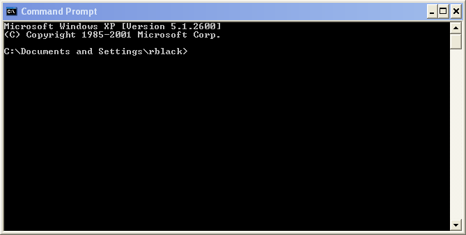
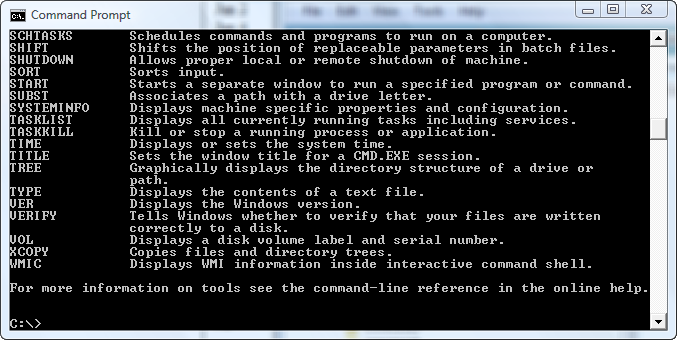
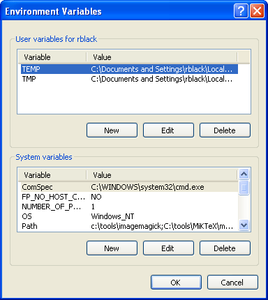

..  _command-prompt:

Life at the command prompt
##########################

..  include::    /references.inc

We want to write programs that will run on some computer. In
your previous courses, you probably fired up some kind of IDE and started
working on your code. Unfortunately, IDEs are not always available, so we are
going to start off by learning how to work in an environment available on all machines.

We are going to do our work as real masters of our machines.  We are actually
going back in time a bit - to the early days of computing, and place you in a
very simple world, the world of the ``Command-Prompt``.

That means we will be controlling our computer using nothing more
than a simple command line interface. On a Linux/Unix system, this interface
is called a terminal window that displays a ``shell`` prompt. On Windows, the
interface is called the ``command prompt window``.

This interface is unusual in today's highly mouse driven world of computers.
You might as well slide the mouse to one side and leave it alone! You will be
doing most work using nothing more than the keyboard. This was the world of
computing when the original IBM PC first appeared on desktops! We will be
using the mouse for some things, but those things will involve running other
programming tools we will need as part of this learning process!

Opening the Command Prompt window
*********************************

We will start off exploring the host machines we will use in this class. In the
labs, we run Windows 7 machines. Let's explore issuing commands with the
keyboard on these systems.

Windows
=======

The `Command Prompt` window on Windows presents you with a slightly updated
version of the old `MsDOS` operating system. No fancy windows, or mouse driven
applications here. Instead, you type in *commands* using the keyboard, and the
operating system runs programs for you. Most of these programs generate text
output which is written on the screen (which we call the *console*), and read
input from the user who types in characters on the keyboard. Simple, but just
what we need for our explorations.

We get to the interface we want to use by clicking on the
`Start` button at the lower left of your screen. Select
`All Programs --> Accessories --> Command Prompt`` and you
should see the interface in all its (boring) glory:

What are we seeing?
===================

This window is basically what all computer terminal screens looked like before
Bill and Steve visited Xerox. The ``command line`` is that line of text you see in
the window. It is called the ``prompt``. The ``prompt`` tells you  operating
system is ready for input from you. The text on the ``prompt`` identifies the
current *directory* (that thing Microsoft insists we call a folder now), and
the current disk drive that directory is located on. In the above example, the
system expects to be working in the what Microsoft considers my 
"home directory" on the **C** drive. (You should be comfortable with the file naming
conventions of Windows - names separated by back slashes.)

..  note::

    Remember that folders can contain other folders, and those folders can
    contain yet other folders. What a mess. Microsoft uses the back-slash as a
    separator between folder names to indicate which nested folder you are
    currently ``working`` in. We will learn how to move to a different folder soon.

Now, what we type on the console when we see the prompt is interpreted by the
system as a request to run some program, or to run a utility built in the
`MsDOS`. To see what these built-in utilities are, you can type
`help` at the prompt, then press the `Enter` key. This is what
you should see:

Notice the scroll bar on the right side. The list of utilities is pretty long,
and you can scroll up to see what went by. Typing `help` followed by
the name of the utility will give you more information on how these utilities
work.

Generally, you type in a command (a single word that is the name of the
command) and possibly a list of space separated ``parameters`` needed by
that command. When you finish typing in the command line, pressing the
`Enter` key will cause the operating system to attempt to run the
command. 

Why did I say attempt? Simple, The name you provided must be found on the
system before it can actually be run. Some commands are built in (those
that show up when you type ``help``) and the system knows where they are
with no problem. Others must be hunted down by the operating system. Those
commands are actually the names of program files that should be installed
on your system somewhere. Windows needs to look for the right file and run
it to do your bidding.  

How the system finds the program is a bit complicated. There is a special
system variable known as a `search path` which is just a series of
directory names separated by semicolons, that is used to tell the system where
to look for the program you have specified. You can see this `search
path` by typing `set path` at the prompt:

..  code-block:: bash

    C:\>set path
    Path=C:\WINDOWS\system32;C:\WINDOWS;C:\WINDOWS\System32\Wbem;c:\tools\bin;C:\Program Files\BitScope
    PATHEXT=.COM;.EXE;.BAT;.CMD;.VBS;.VBE;.JS;.JSE;.WSF;.WSH

    C:\>

..  warning::

    What you see will definitely be different from this. The actual line
    depends on what software you have installed on your system. On some systems
    this display gets huge!

..  _set-path-variable:

Setting the PATH variable
=========================

We can modify the **PATH** variable that contains the list of directories to
search and add our own entries if needed. To do this, click on the
`Start` button, then select `Control panel`. (You
might need to switch to `Classic view` if you are running
Vista). Next double-click on `System` and then click on the
`Advanced` tab. You should see a button marked
`Environment Variables`. Click on this and you will see
something like this:

..  note::

    You can also get here by right-clicking on ``computer`` in Windows Explorer
    and selecting ``properties``, then ``advanced system properties``.

This window is divided into two parts. The top part contains lines for the
current user. If more than one person uses your computer, each might log in
with a unique name. Changes you make here are set up for the user who logs in.
In the second panel, changes you make apply to everyone. If you are the system
administrator, or the primary user of the system with the right privileges, you
can make changes here. You will know if you can by noting that the buttons are
not grayed out.

In the bottom panel, scroll until you see the **PATH** variable. Once that is
visible, click on it and select `Edit`. Now add the new
directory at the end of the list that is already there. The new entry must
start with a semicolon then the full directory path. The semicolon is a
separator, so do not forget it.

Once the new entry is in place, click on **OK** and close out this window. You
will need to start a new ``Command Prompt`` window to see this change. The
environment is configured as the window starts up, and changes you make here
will not be seen in the current window.

The `PATHEXT` is a list of file extensions the system will
automatically look for when you type the program name. We normally do not
type in the extension when we try to start a program. The system looks in
the current directory for the program specified, than looks in the
directories on the path in order, looking for a match.

..  note::

    One entry in this list is especially interesting. Any file that ends
    with ``.bat`` is assumed to be a ``batch file``, that can contain a
    list of commands you would like to execute all at once. This is a handy
    way to do some complicated task over and over. In the Linux world,
    files of this type are called ``shell scripts`` and do basically the
    same thing. There are a few program code-like constructs that can make
    batch files pretty interesting. I prefer to build scripts to control my
    system using Python!

If you want, you can modify this path by adding your own directory names. I
normally add `c:\\tools\\bin` to my path, as you can see above,
and install my own utilities programs in that folder to make my programming
life easier.  I hate directory names with embedded spaces and huge long
names. (See `set-path-variable` for details).

If the program is not found, you will get an error message, and you can
enter the full name of the program file, including the directory name in
which it can be found. For instance, I have a program file named
`zip.exe` living in my `c:\\tools\\bin` directory. I
could use either of these commands to run this program:

..  code-block:: bash

    c:\>zip

    or

    c:\>c:\tools\bin\zip

So, it is possible to run just about any program by entering the full name of
the program file at the prompt, followed by the parameters needed by that
program.

We can change the working directory by using the built-in `CD` utility:

..  code-block:: bash

    C:\>CD \temp
    C:\Temp>

Remember that Microsoft does not care about what case is used in commands!

We can change the working disk as well by simple entering the new drive letter
followed by a colon. On a lab machine, this would work:

..  code-block:: bash
    
    C:\>H:
    H:\>

The system will look for files with any of the legal extensions if all you
enter if the name part (minus the extension) and run the first one it
finds. If it cannot find a file with any of the possible extensions in any
of the directories listed in the ``PATH`` variable, you will be an error
message.

Play around at the command prompt and you will soon be able to do a lot of
work. Heck, this used to be the only way we could control the computer - in the
days before the mouse showed up (Thanks Xerox!) We will learn more about this
way of working as the course progresses.

Working in Linux
****************

The ``command prompt`` work is very similar in Linux, except that just about
all commands are really programs loaded somewhere on your computer. You need to
open up a ``Terminal`` program to get to the ``command line``.

Linux also uses a **PATH** variable to control where it looks for programs you
specify. You can also add your own directories to this path, but we do that by
editing a control file in your home directory. Also, a big difference when
working with Linux is that the ``path separator`` is a forward slash, not a
back-slash as in Windows. This is a big pain, but one most folks get over soon
enough!

Most of the commands you use in Linux are the same as the commands on Windows.
But, there are a few significant differences. For instance, when you want to
see the files and directories stored in any directory on a Linux machine you
use the ``ls`` (short for "list") command. On Windows, the command is ``dir``
(short for "directory").

..  note::

    Why do we use short commands? Simple - programmers are lazy, and proud of it!

We will go over the basic commands you need to know to work on projects in
class when we get your working environment set up. Google a bit for "command
line" tutorials and you will find plenty of help learning all this! Trust me,
it will be good experience for you!
