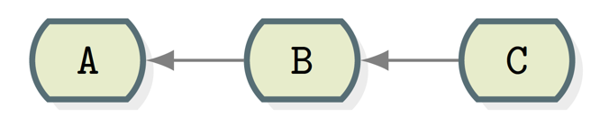

..  _`programmer-workflow`:

The Programmer's Timeline
#########################

..  include:: /references.inc

Before we start this class, in which you will learn how to write programs using
a new language, let's stop and talk about the process of programming.
Specifically, let's talk about how you will spend your time!

That is easy, you will sit in front of your computer, furiously typing in code
in this new language. All the while, you will be praying that what you are
typing is correctly entered, and will solve whatever problem you are supposed
to solve. Right?

Wrong!

Worse yet, you might just search the Internet for some code that looks right,
and copy-and-paste something to work with (or submit. Hee, Hee!)

..  warning::

    Sorry, that is not going to work either. I am far smarter than you think in
    spotting this kind of trickery! Try it and watch your grade evaporate!

    Unfortunately, you cannot copy-and-paste your way through a job
    interview. Doing this teaches you absolutely nothing. That is why I
    am going to pay a lot of attention to how you do your work in this
    class. Hopefully, you will develop the kind of good work habits (and
    a work ethic) that will move you along nicely through your future career!

Time Marches on
***************

Solving any problem, a programming problem, or fixing your car, involves
a sequence of blocks of time. Unless it is a very small problem, you are
sure to do the job in several work sessions. Each session will take a
different amount of time, and will end when you decide you are done for the
moment, stuck, or just plain want to quit working on this problem for the time
being.

We will show this sequence of work sessions on something called a timeline.
Those of you who remember flow charts will feel right at home here:

This entire line is called the timeline. Time moves along from left to right in
this sketch. The arrows go in the opposite direction, but why? When we make
changes from one version to another, we say that the next version is derived
from the previous version. The previous version is called the parent of the
next version. The next version is the child of that parent. The arrow points to
the parent of each node. I know this looks wrong, but this is common when
showing diagrams of the timeline.

How we draw this thing does not really matter. What does matter is that we have
a sense of where we are on the time-line at any moment, and have a memory of
where we were at points in the past.  We quit work on the project any place we
show a marker, and continue on at a later time. When we are finally done, the
timeline simple ends with a final marker.

Simple, huh!

Instead of words or phrases, we will just show numbered markers in time where
we stopped (or started) work. You actually do your work along the line
connecting two markers. How much time each work session takes is not really
important, unless you are being paid by the hour, or your company wants you to
log your time. For our purposes, we will ignore that.

Markers
=======

Each marker on the timeline represents a potentially big chunk of time when
exactly nothing is happening (on this project, at least). You are not moving
the project forward at all, it is in a stable state, and will remain in that
state until you begin work again. Sadly, some projects will never move forward
again, they will simply be abandoned. As you are learning, this is not something
you want to experience, but there is another old saying in programming:

    Plan on throwing one version of your project away, you will do so anyway!

..  note::

    I wrote a very complex Python program for a Master's degree at Texas State.
    The one I actually used was the fourth version I wrote. The key thing to
    remember is that you learn something each time you stop, and do a better
    job next time.

Working on Your Project
***********************

My goal in this discussion is to teach you what to do as you move along
that timeline, and how to properly end each work session. Sorry, it is not
as simple as standing up and walking away! If you do that, you may regret it
later!

What you will create
********************

Programming, or rather, software engineering, is a creative process.
Your tools are your keyboard, a code editor of some sort, a programming
language and whatever tools you need for that, and your brain! You have a lot
of thinking to do, and a few major tools to learn about. In the end, you will
use your brain, and the other tools to write a program, right.

Of course! But, I want more (so will your boss). As you work, I want you to
take notes as you do your thinking, and be able to explain to some poor soul in
the future what in the world you were thinking when you created that code!

An old joke among programmers goes like this:

    Pretend the person who has to maintain your code is a serial killer
    who knows where you live!

A bit extreme, but good advice!

How to Get Started
******************

Even before we learn how to create anything in this new language, we probably
have some sense of how the process will go:

    * Sit down in front of your computer and start up your editor.

    * Open up a code file, and type away.

    * Save your work on your hard disk.

    * Try to process your code file with your language tools

    * Fix the errors that you find

    * Repeat, over and over until you want to quit (or finish)!

Well, that may be how programmers used to do things, but we want to do things
smarter. We will use a modern tool to manage all of our code, and you will see
how important that can be soon enough!

Step 1: Create a Project Home
=============================

The real first step in any project is setting up a home for the project. How
you manage your machine is not so important, but it is important that you set
up a directory (folder for ou Windows folks) where all parts of your project
will live. We will go over the exact layout of a good project in class, but for
now, you need to set up one master directory, and make sure everything you need
for the project lives under that directory.

In my classes, I assume we are working in a command-prompt window, or a "shell"
where we type in commands to the operating system.

..  note::

    Many of you have never used this environment to work on your systems. You
    might have been trained to use an "Integrated Development Environment". You
    really need to learn to work on the command line, since it is highly likely
    you will end up working with servers out there in the "cloud". Most likely,
    those systems will not have a graphical interface, and learning how to work
    there now, while you are in school, is a very good thing!
    
Here are the commands used to set up your project home:

..  code-block:: bash

    $ cd projects (where ever you decide to keep your work)
    $ mkdir ProjectName
    $ cd ProjectName

At this point, you are almost ready to start work! I say almost because we need
to do one vital thing: set up the project so it can be managed by a "source
code control system" like Git_!

Step 2: Manage your work with Git
=================================

We will use a tool designed by Linus Torvalds to help him manage the Linux
Kernel project. Since he introduced this tool to the development world, it has
taken off and is arguably the most popular tool for managing code going today!

Git_ basically makes a copy of your entire project in a very efficient, compact
form, every time you want one. It does nothing by itself. Instead, you are in
charge.

Basically, in Git_ we create a "commit" whenever we like, and those translate
into the markers we have been discussing up to this point.

Git_ stores everything it needs to do its magic in a single directory, named
``.git``, at the root (top) level of your project.

The most common (but not only) way to create this management directory is to
use the following command:

..  code-block:: bash

    $ git init

This must be done from a command prompt while working in the project directory.
The dot at the beginning of the name makes the directory "hidden", meaning you
have to use a special command to see it.

On Mac/Linux, do this:

..  code-block:: bash

    $ ls -al

On Windows, do this:

..  code-block:: bash

    > dir /a

In either case, you should see the management directory.

Remote Servers
==============

Most projects use a central server to store a "master" copy of all project
code. This allows a team of developers to work effectively on a project. In my
classes, we use Github_ (specifically, a service called Github_ Education) as
that server. Even though a lot of your work will be done individually, you are
part of a team of two people: You and your instructor!

The copy on the server should always be though of as the real project
code. You will copy this code onto your workstation and work on it
there. You are not really done with any work session until the version
you have at that moment is safely up ther on the master copy server!
Git_ makes this easy.

We need to connect your working copy to the master "remote" copy. Again
ther are several ways to do this. To keep things simple for this
discussion, I will show you how we will do things in my classes.

Signing Up On GitHub
********************

As you start your course, you will be asked to create a personal account on
Github_ and provide the user name you set up to your instructor. 

..  note::

    Consider this a start on your professional portfolio!

Joining the Class Orgnaization
==============================

Once that is done, you will be invited to join a class "organization" which is
a way we can keep your work private.

..  warning::

    Remember this is an academic setting, and you do not want your work made
    public so others can "borrow" your work and use that to get an easy grade!

You will be provided with a "master" project directory for your class work.
This class "repository" (a fancy term for a Git_ managed project directory) is
empty, and you will add your class work to your personal copy, which we will
create soon.

Although it is common to create separate Git_ managed projects for each lab
project I assign, I decided this is a bit much for beginners to Git_, so we
will use a single repository for all lab projects. For some reason, I decided
to name this "repo" (short for repository) "Labprojects".

There is one more concept we need to discuss before we can set things up for a
class. That is the concept of a "fork".

Forking a Project
-----------------

In the open source world, it is common for developers to contribute to projects
they find interesting. These developers are not part of the project development
team, they just want to help out.

Git_ supports creating a special copy of the project that remembers where it
came from. It is a completely independent copy that will be used by the
contributing developer to work on their contribution.

We will use this concept in our class work. Basically, each of you will
"contribute" your work to the common class project. However, your work will not
be included in the class project, it will be kept separate and I will grade
your work, not combine it with other project code.

In a real project, the contributor will decide to offer their work to the
project team by creating a "pull request" that is sent to the original
development team. That team can review the work and decide if it is good
enough to include in the project. If so, they can merge the provided code into
the main project repository. We will not be doing any of that in our class work!

Setting up your class Repo
**************************

..  note::

    You must be set up as a member of the organization for this to work!

Basically, when you sign into your GitHub_ account, you will see an icon for the
iclass organization on your profile page. If you click on this icon, you will see
repositories set up for your class. If you select any of them, you will see an
icon labeled "fork" to the right of the project name.

If you click on that, you will be asked where to create this copy. You select
your personal account, and the copy will be available for you to use. However,
this copy is on the GitHub_ server, not your workstation, so we need to fix
that!

Cloning the Class Repo
======================

The real beauty of using the "remote server is that is acts like a great backup
for your work. You can lose you machine, and get all of your project code bck
by copying the project from the server onto any workstation with Git_ (and the
other development tools you need) installed.  The copy we create is called a
"working copy" and we create it by "cloning" the master project.

Assuming you have Git_ installed on your system, and have a directory set up in
which you want to create this clone, do this:

..  code-block:: bash

    $ git clone https://github.com/username/LabProject

You may need to provide your Github credentials before this command completes.
When it is done, you will have a "LabProjects" directory on your system. Inside
that, you will find a ``.git`` directory. Best of all, it is all set up so you
can send your modifications to the server with a simple command (well, actually
a few commands). We will look at that next.

Work Sessions
*************

We are now at a point where we can discuss a normal work session. We are not
going to worry about exactly how to pick something to work on. Obviously, we
cannot solve the entire problem in one sitting, unless the problem is very
simple. So, we carve off a small part of the problem and start working on that.
We call this breaking up of one problem into several smaller pieces
"decomposition". Learning how to do this takes practice, and we will not cover
that here. Instead, we will assume you see something in the project you feel
you can tackle, and decide to work on that.

You will start a work session with your project in a stable state, and make
changes to it until you feel you can test it. My philosophy is that you only
add a few lines of code before you try that test. By doing this, you will catch
typing errors very fast, and not spend large amounts of time chasing silly
errors you should not be making!

When you try to run your code, it is important to have some idea what to expect
if it runs. Of course, things will not run perfectly now, but you should know
how to tell things are on track.

The point of this approach is that you spend more time working on code that
actually runs, not sitting there editing code that the language tools choke on!

If your tests are working, your project s stable, and you can choose to mark
that point in time by creating another marker. You do not need to stop work
when you do this, some programmers create markers very often in any given
session.

Ending the Session
******************

Do your work, test it, and when you feel it is worth creating a marker for the
project at this point, do this:

..  code-block:: bash

    $ cd ProjectName (get to the top of the project directory)
    $ git status (to see what Git_ thinks of the project now)
    $ git add .    (Note that dot!)
    $ git commit -m "log message"
    $ git push origin master
    $ git status

That is a lot of typing, and all of it is important!

The ``git status`` command is a great way to see what you have changed in your
work session. You will see any files (or directories) that are new, deleted, or
modified since you started working on this session. It will also tell you if
your working copy is in sync with the master copy on the server.

The ``git add`` command tells Git_ to manage all of the changed files. They
are not officially registered with Git_ yet. Instead, they are "staged" for
later when we create the marker!

The Git_ ``commit`` command actually creates a marker for our project. This is
important, we can recover exactly this version of the project nay time we wish!
The log message should be some phrase to help you identify what was going on in
this session.

The final ``git push`` command is what actually sends this new marked version
up to the remote. Traditionally, the remote is named "origin".

Is this worth the effort?
*************************

Absolutely! Once you train yourself to use a tool like Git_ to help you manage
your work, you will wonder why any one ever works without one. I manage almost
everything I do on a computer using Git_ and it has proven itself over and
over, saving me from hardware failures, and bad design decisions when I write
code.

Better than that, since I have Git_ installed on all of my development systems,
I can easily "clone" projects I find interesting on Github_ and study that code any
time I like. If I want to , I can contribute to the really interesting
projects, or discuss the project with the developers. I have made more than a
few professional contacts with some impressive folks in the open source world
that way!

It will take some time for you to "come up to speed" learning all of this. Do
not worry! Nothing about Git_ is going to appear on any exams I give. This is
my attempt to get you ready for your professional work! If you want to learn
more about Git_ and all of its power, check out the `Pro Git
<https://git-scm.com/book/en/v2>`_ book, available as a PDF file for free.

..  vim:filetype=rst spell:

