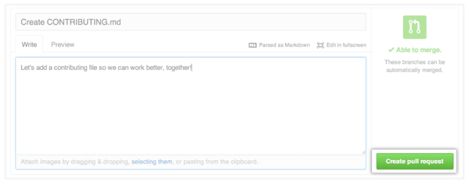

..  _github-workflow:

Completing Assignments Using GitHub
###################################

..  include::   /references.inc

The process you will follow to complete an assignment for this class is
identical to the one you will use when working with a team. Your team may just
include you and your instructor, or it may involve more classmates.

Find the Project on GitHub
**************************

Start off by opening up your web browser and navigating to your GitHub_
account. If you have been invited to join the team that will work on a project,
you will see the project in your list of repositories.

Create a Fork of the Assignment
*******************************

At the top right of your screen, you should see a ``Fork`` button. Click on
this, and select your personal account as the destination of this "fork".

A ``Fork`` is a copy of the original project that is tied to the original, but
independent. You are free to work on this fork, and make changes. You will be
doing this as you complete the project.

The copy exists only on GitHub_ at this point. 

Clone The Project to Your Workstation
*************************************

On the development station you will be using, create a clone of the project
using this command:

..  code-block:: text

    $ git clone https://github.com/rblack42/RPNcalculator.git
    
..  note::

    You can copy this URL from the GitHub_ project page by clicking the "HTTPS
    clone URL" box on the right side of the page.

This will create a directory on your workstation with the project name. You will
open up a shell (:term:`command prompt`) window and work on this project in
that directory.

Working on the Project
**********************

Make changes to the project as needed. You can add files, create directories,
as you want.

When you get to the point where you want to stop working for a while, do this:

..  code-block:: text

    $ cd <to the top level project directory>
    $ git add .
    $ git commit -m "commit message"
    $ git push origin master

In your commit message, put your initials at the beginning of the message, then
the message itself. Something like this:

..  code-block:: text

    "RRB: This is a commit message"

We will explain why we need to do this in class.

Notifying the Instructor of Changes
***********************************

When you are finished with your work, or when you need help with the project,
your will send the owner of the project (your instructor) a "Pull Request"
informing them you have changes you have made to your "fork", and you want the
owner to review those changes.

Open up your GitHub_ page and navigate to your forked project page. On the
right side of this page, you should see a menu item labeled "Pull Requests.

Click on this menu iten, and you should see a message box indicating you have
made changes.

CLick on "Create Pull Request" and you will see a box where yu can add comments:

When you submit this form, the owner of the project (your instructor) will get
that message and can reply or grade the work.

Click on "Submit Pull Request" when you are done. 

..  vim:filetype=rst spell:

