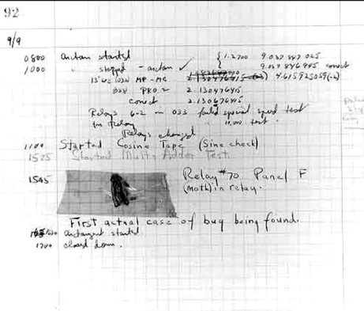

..  _installing-sphinx:

Using Sphinx to Document Projects
#################################

..  include::   /references.inc

Every software development project should be documented. In many (most) courses
where you learn how to create programs, the focus is on the programming
language, and problem solving techniques. Seldom do we discuss how to document
what you are doing.

Why Document Your Project
*************************

It is a sad fact of life that many programs are thrown out because no one
understands what they are doing, how they work, why they were built the way
they were, and how to fix, or extend them to meet current or future needs. In
short, they are poorly documented.

As an example of how bad things can be, back when I was working as a
consultant, I was once invited into a department head's office to discuss a
critical piece of software that department depended on on a daily basis. The
department needed to add a new feature to the program. The conversation
went like this:

    "Do you have the program source code?"

    "Yes", and he handed me a tall stack of paper with hand written notes all over it!

    "Do you have any other documentation?"

    "No"

    "Is the developer available?"

    "No, he died last year!"

Sorry to hear that. It turns out the department had to go ask the developer's
wife if he left anything behind that might help them. They found the listing he
gave me in his home office. The listing was old, and did not really match the
program they were using. That was all they had!

Sad story. Even sadder was my recommendation:

    "You are going to have to use the current program as a model, and build a
    new one from scratch!"

The department was not happy hearing this, but had to agree that this was the
best approach.

Programs need sufficient documentation so the people who need to work with that
program have some hope of being able to maintain them. Programs will always
have "bugs" in them, that others will have to fix. They need to know how the
program was designed to be able to fix one problem without introducing new
problems. The person who has to do this might be the original developer a few
weeks later, who cannot even remember why they wrote the code that way in the
first place.

..  note::

    I have code around I wrote 40 years ago! It is fun to see how poorly I used
    to do things. I thought I was a good developer back then. Boy, did I have a
    lot to learn!

Taking Notes
************

Engineers in the past always kept "Engineer's Notebooks" on any major project
they worked on. Of course, that practice dates back to the stone-ages, before
computers were invented. Probably the most famous page out of such a notebook
is this one:

    
This is a page from Grace Hopper's notebook where she found a moth stuck inside
a relay in the Eniac computer, the first electronic computer built in the U.S.
She made this notation::

    "First actual case of a bug being found."
    
Today, there is no need to write things down manually.  Fire up your favorite
:term:`programmer's editor`, and take notes there.

Publishing Your Documentation
*****************************

Your project should be managed in a good :term:`source code control system`,
like Git_, today's favorite :term:`SCCS` tool. The project assets, everything
needed to build the complete, running, program, should be stored under a single
directory on your development system. One major subdirectory should hold the
"docs", your program documentation.

Documentation Tools
===================

To encourage you to do a good job in creating your documentation, there are
several nice tools available to help you produce quality documents from your
notes. I have been using a Python tool, Sphinx_, to create my lecture notes
(including this one), even when the project has nothing to do with Python!

Sphinx_ lets you write your notes up using a simple :term:`markup language`,
then run a Python program that reads your notes and produces web pages suitable
for publishing on a web server, or as PDF files suitable for printing out (if
you like doing that!) I highly recommend starting our writing your
documentation using this tool set.

..  note::

    A side benefit of going this way is that note files, written in the
    reStructuredText_ markup used with Sphinx_ will automatically be formatted
    as nice looking web pages when you push your project files up to GitHub_,
    which I am now having students do in some of my classes.

Installing Sphinx
*****************

You need a standard Python_ installation to use Sphinx_. So, your first step is
to make sure you have Python_ installed. I will show how to do this from the
:term:`command line`. (see :ref:`command-prompt` if you are new to
this).

..  code-block::    text

    $ python --version
    Python 2.7.10

Sphinx_ will work with Python 2.7.x, or Python 3.4.x.

Next, make sure your Python installation has included the standard Python installer tool Pip_.

..  code-block:: text

    pip --version
    pip 7.1.0 from /Users/rblack/_acc/general/_venv/lib/python2.7/site-packages (python 2.7)

..  note::

    That last line is identifying the specific Python program I am running, and
    where it is located on my system. I use something called a :term:`Virtual
    Environment` when I do Python development. That is not needed in general,
    but is a good idea if you do a lot of Python work. See
    :ref:`installing-virtualenv` for more information on this).

..  vim:filetype=rst spell:

