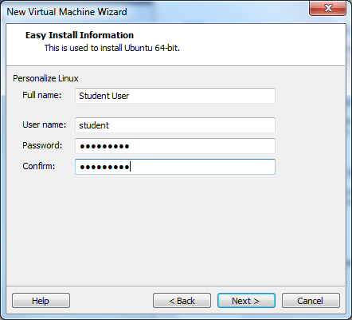
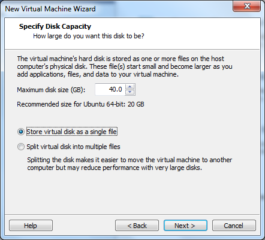
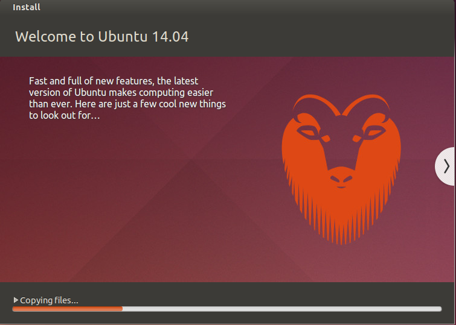

.. _installing-ubuntu-desktop:

Setting Up the Class VM
#######################

..  include::   /references.inc

We will be using a desktop version of Ubuntu_ Linux to run software for this
course. The :term:`VM` will be a 64-bit system, meaning that you need to set
this up on a system with a suitable 64-bit processor. 

..  note::

    If you are not sure that you own such a system, download this application

    * :download:`VMware-guest64check-5.5.0-18463.exe`

    Running this (on a Windows system) will tell you if your hardware is
    suitable for this course. If not, see me immediately and we will set you up
    on a Rackspace_ server that you can use for your work. Note that in this
    case, you will not have access to the GUI applications, just a simple
    command line environment.

Before you can install the operating system for the class, you need to install
a :term`virtual machine` program. For Windows systems, we will be using VMware_
Player, a free tool you can install by following
:ref:`Installing-vmware-player`.

Download the OS
***************

We start off by downloading the operating system from the Ubuntu_ website. The
version we will be using is 14.04 LTS, meaning that it will be supported for at
least five years. We will be installing the desktop version, complete with a
GUI, but you are free to use the console-only server version which will let you
simulate working on a remote server.  

This is the file you can use to set up your machine:

    * `ubuntu-16.04.1-desktop-amd64.iso
      <http://releases.ubuntu.com/16.04.1/ubuntu-16.04.1-desktop-amd64.iso>`_

Installing the OS
*****************

The new VMware_ Player tool is pretty smart. It has detected the version of
Linux being installed, and pretty much automates the entire installation
process. All you need to do is sit and wait for it to finish.

Start up the VMware_ Player program:

..  image::     VMsetup1.png
    :align: center

Next, click on the :menuselection:`Create a New Virtual Machine` link:

In this window, you will need to browse your system to find the `.iso` file you
downloaded. Once that is selected, you should see the system detect the OS you
are going to install. Click :menuselection:`Next` to continue.

In this screen you will enter information for the administrator of the system.
This user has full control of the OS, something that is much safer to play with
here, rather than on a real server!

Enter your name, user name, and password, then click on :menuselection:`Next`
again.

..  image::     VMsetup4.png
    :align: center

Here, we give the system a name, and indicate where you want to store the
files. Do not put this folder on your desktop. Select some place out of the way
on your system.

Click :menuselection:`Next` yet again.

On this screen, you select the size of the virtual hard disk you want. For a
server, this can be around 10GB, but for a :term:`GUI` desktop version, 40GB
seems about right. This disk image will be stored in a file on your system, and
it will start off fairly small and grow as you add software to the system. 

One more :menuselection:`Next`:

..  image::     VMsetup6.png
    :align: center

Here, you get to review the settings so far There is an option to customize the
hardware here, and we need to do that to set up the memory required for this machine:

Click on the :menuselection:`Customize Hardware` link:

..  image::     VMsetup7.png
    :align: center

On this screen, you will decide how much of your system's memory you want to
dedicate to the :term:`VM`. For a server this can be as small as about 512MB,
but for a desktop, I recommend around 1GB. (You should have a minimum of around
4GB on your system to run the :term:`VM` so this is not going to slow the rest
of the system very much.

Click :menuselection:`Close` when you have the setting in place:

Finally, we can turn the installation loose!. The OS should install unattended
and eventually show you a login screen:

Use the credentials you set up earlier to log in to your new machine. 

Updating the system
*******************

It is quite possible that the system you installed is not up to date. After the
basic installation, and after you log in, you may see a pop-up screen offering
to update the system:

..  image::     VMsetup10.png
    :align: center

The first time you do this, it will take a while. There are many packages on
the system, all of which undergo updating by the thousands of open-source
developers whose work you are benefiting from!

Let this proceed and you will have an up-to-date system. You can update things
as often as you like after you get the system running.

The next step is to learn a bit about operating this system. There are many
good guides to Ubuntu_ Linux on the Web, but we will be spending most of our
time working with the :program:`Terminal` program, so we will learn about that
next!
