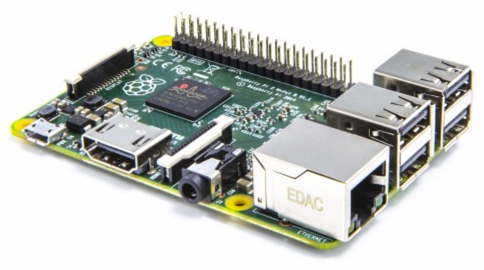

..  _gp1:

Group Project 1: Exploring Hardware
###################################

..  include::   /references.inc

For our first major Group Project, we are going to study the architecture of a
typical processor found in commercial products of all kinds. We will not
include the Pentium in this project, we will be studying that in class.

Team GitHub Repos
=================

The invitation link for your project is here:

    * `COSC2325-001 (HLC) <https://classroom.github.com/g/TQXtYgHV>`_

    * `COSC2325-002 (SAC) <https://classroom.github.com/g/0xp1wSvH>`_

When you accept this invitation, you will be asked for the name of your
team. Use the names we set up in class (capitalize the first letter
only). Only the first student who accepts the invitation will have to
enter the team name. All others will select from an "existing team. 

..  warning::

    Let me know if this fails to work as advertised.

Raspberry Pi
============

Each group will be given a system for study. You may need to provide a few
additional components to get things running.

This machine is hugely popular in the Hobby/Education worlds. The machine is
inexpensive (around $35) and has enough horsepower to run Linux. The processor
on the board is an ARM, which powers a variety of commercial products.

The lab kit will contain the following components:

    * Raspberry PI Board (Models 2 and 3 are available)

    * Power supply (2.5 amp 5V wall-wart supply)

    * 32GB Micro HD flask card with an adapter

    * HDMI cable

To set this system up, you will need a keyboard and mouse with a standard USB
interface. If you have a standard ethernet network cable, you can hook the PI
up to your home router and reach the internet. Internet access will not be
available on ACC campuses. it is possible to set these systems up "headless"
using an ethernet cable connected directly to your laptop. Students in other
classes have done this using both PC and Mac systems.

Initial Project
***************

Your first project is just designed to get familiar with this system. The focus
here is on the machine, not the software. You will need to do some research to
find a operating system to install, load that system on the SD card, plug the
card into the PI and boot the system up. If all goes well, you will end up
working in an environment much like our class VM.

Once that process has been completed, you need to explore the board itself, and
see what it has to offer.

Exploring Docker
****************

Since we are learning a bit about virtual machines in this class, it is
appropriate to show you one of the most important new tools active in the
"cloud". Docker_ is a light-weight "container" that includes most of components
needed to run an application inside of a virtual machine, but it shares one
base virtual machine with other containers. Only the base virtual machine
actually interfaces with the host operating system.

Docker_ lets you isolate one application from another one, but still lets those
applications speak to each other over a network connection. A typical Docker_
setup might have a web application in one container, a web server in another
one, a database engine in a third, all hosted on one machine. The surprising
thing is that all of that can live on a machine as simple as a  Raspberry PI!

The goal of this part of the project is to see if you can get Docker_ installed
and run something simple on the Raspberry PI using the tool. You do not need to
do anything complicated, just get far enough to get a feel for what Docker_ can
do. 

Here is a link to get you started:

    * http://blog.hypriot.com/getting-started-with-docker-on-your-arm-device/

Experimenting with Hardware
***************************

I have a variety of add-on boards that can be checked out if you wan to play
with a bit of hardware as well as Docker. These boards plug onto connectors
found on the PI and may have LED displays, sensors of various types. I will
bring these to class and they are available on a first come first serve basis.
Adding a hardware component will be worth an extra 20 points for the project.

Lab Report
**********

You will be writing this up in a lab report. The exact format of this report is
up to the group, but at a minimum it should include sections outlined below.

You will be required to write this report using reStructuredText_ markup.
(You can see examples of this notation in my lecture notes). If done right,
Github will format your pages for you so they look nice when viewed in a web
browser. Nothing fanc is required, but short, one paragraph sections will not get ful points. Treat this like a term paper.

Board History
==================

The first thing you need to do is do some basic research into what this board
was designed to do, and where it is being used. You may be surprised to find
out how popular these systems actually are, and why their designers built them
in the first place.

Basic Board Setup
=================

You will need to identify exactly what resource you need to have in hand to
power up your board. In some cases, you will need cabling to attach it to
external devices, and external power supplies. All necessary parts are
available, but your group will need to request the necessary parts.

Development Tools
=================

You will need to explore acquiring and installing the development tools for
this machine. All are readily available, and many are variations of the Gnu
Compiler tools we are using in class already!

Download and install the tools needed and build a sample application that
demonstrates you can make something happen using this machine. (A "Hello,
World" demo will do for this part.)

Processor Architecture
======================

Locate the manufacturer's documentation for the specific processor found on
your system. In that documentation find out how the chip is organized, and
discuss its major features. You should find a block diagram similar to the one
I presented for the Cycsi machine we are building in class.

Processor Assembly Language
===========================

You should also research the basic instruction set contained in your processor.
You do not need to explain each instruction, just the major classes of
instructions supported by the processor. 

Demonstration Project
=====================

Once you have the system set up and can run programs on it (it will just be
inux at the command line), do your work with Docker_. This section will
describe what you did to set things up.

Project Report
**************

Your project should be documented using reStructuredText_ notation in a
collection of pages authored by each team member (one section per member is
sufficient). The documents should set up so they display properly when viewed
on GitHub_. The notation you use is pretty simple, and is described in
documentation available online.

..  note::

    GitHub_ does not process this markup completely, so keep your documentation
    simple. I recommend setting up your documentation pages right away and
    experimenting with it as a group to make sure the notation you use actual
    displays the way you like. You will be able to link in images, set up
    tables, and use headlines of various levels with no problems. See my
    lecture notes for examples of using this markup.

When is this due?
*****************

You will have three weeks to complete his project. Each group will present their
findings in class on the first meeting of the week starting March 27.

..  vim:filetype=rst spell:
