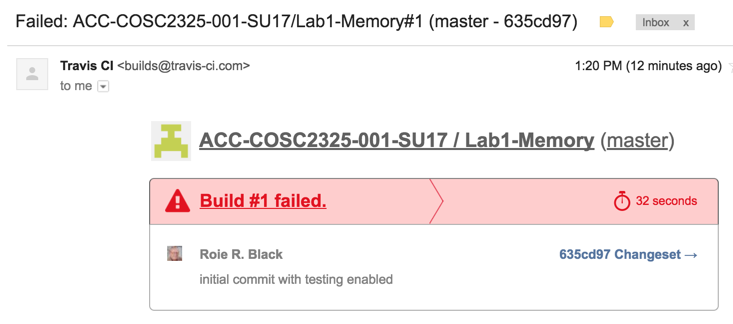

..  _diary-of-a-mad-black-programmer:

Diary of a Mad Black Programmer
###############################

..  include::   /references.inc

Hey, my name is "Black". I can get away with that!

..  warning::

    This is looong! but you really should read it and think about the work I am
    showing you. You will be doing some of this for all your lab projects.

    Practice, practice!

Gee, it is a nice morning, 

    "I feel the need - the need to CODE!"

(Enough of this theatrical nonsense - let's get to work)

Today, the boss handed me a problem to work on. She said I need to write a C++
class that models a memory unit in a computer. I seem to remember how to write
C++. Maybe now is a good time to try out that *Test Driven Development* stuff!

Scene 1: Let's Build Some C++ Code
**********************************

(OK, I lied!)

Here is the problem I need to work on. She said it was simple, but I am not so sure:

..  include::   code/Memory/docs/ProblemStatement.inc

Phew, That looks complicated.I need a break, while my head cools off!

Scene 2: Getting Started
************************

Well, I have thought about it a bit. Maybe the best thing to do now is tear
that statement apart and make sure I know what I need to really do. I can use
my trusty editor to do that! OK **vim** let's see what we can come up with!

Act 1: Break up the Problem Statement
=====================================

..  warning::

    This is ALSO long, but it shows one (good) way to get started!

..  include::   code/Memory/docs/ProblemStatement_1.inc

All we did here is split the original statement up into individual sentences,
so we can study each one to see what we need to do.

Act 2: Eliminate the Fluff
==========================

Several of this lines are just noise. They do not tell me to DO anything.
Others need to get reordered a bit. Let's see what that produces:

..  include::   code/Memory/docs/ProblemStatement_2.inc

Better! Now I am starting to see what needs to be done to build this thing!
 
Scene 3: Starting to Code
**************************

I am getting tired of all this thinking stuff. Let's write some code!

(Sound of my trusty Macbook being fired up. Those of you with Windows PC
systems can go get some popcorn!)

Let's see. What is the smallest chunk of code I could write that could possibly
work? Well, I do not need an application, just something to test. This will
prove that my test system works.

Hmmm, I better set up a folder for the project. 

..  code-block:: bash

    $ cd cosc2325

You always need to organize projects. This one is for my class organization.

..  warning::

    In this class your project folder is already set up. In the real lab
    projects, you will "clone" a template repository I set up for you. It will
    not be complete, just a start. Keep all of these clones in a single folder
    so things are easy to find (and back up). I am showing the steps I do to
    create a project from scratch.

..  code-block:: bash

    $ mkdir Lab1-Memory

The project has a name, my boss gave it to me! 

..  code-block::    bash

    $ git init

This tells Git_to manage this project. (Duh!) The hidden Git_ management folder
should be in here now. Let's check that:

..  code-block:: bash

    $ ls -l
    total 12
    drwxr-xr-x   8 rblack  staff   272 Jun  4 13:34 .
    drwxr-xr-x  40 rblack  staff  1360 Jun  4 13:09 ..
    -rw-r--r--@  1 rblack  staff  6148 Jun  4 13:34 .DS_Store
    drwxr-xr-x  12 rblack  staff   408 Jun  4 13:19 .git

There it is, along with that silly **.DS_Store** file Macs always leave around.
I do not want that file to end upon Github_ so let's build a **.gitignore**
file to list the things I do not want ending up on Github_:

..  code-block:: text
    :caption: .gitignore

    # Mac
    .DS_Store

    # C++
    *.o
    *.a

    # Vim
    *~
    *.swp

That covers most of the stuff I will be building in this project.
    
I guess i need to get on Github, and set up an empty repository for
this project. (I will do that using their web controls)

..  note::

    Not shown - remember, you don't do this for a class project. I am pretending I
    am working on my own project. Actually, this is what I really did as I wrote
    this lecture!

With the following command, I can hook up my local project with an empty one I
created on Github):

..  code-block::    bash
    
    $ git remote add https://github.com/ACC-COSC2325-001-SU17/Lab1-Memory.git
    
I hope I typed that in correctly. Maybe I should have copied and pasted the
link from the Github_ page.

Scene 4: The first real test
****************************

The boss said the use the Catch_ test system, which is pretty neat. All you
need is a single c++ header file to set up tests. (The example repository has
this file ready to go!).

Catch_ needs a simple **main** file with a special **define** line that
actually creates a ream **main** function. When you compile and link all of the
test files, Catch_ creates an application that will run all of your tests. This
sounds pretty cool.  Here is my first shot at the test files. Opps, I need to
build a folder for these files. I know! I will call it **tests**!

..  code-block:: bash

    $ mkdir tests
    $ vim tests/test_main.cpp

Here it the code I created:

..  literalinclude::    code/Memory/tests/test_main.cpp
    :linenos:

Pretty simple. That define is only used in this one file. The include line is
in every test file.

Here is my first sanity test file. (I took this from a reference I found on the
net! I better put a link to that reference in a file in the project, so I do
not forget where I found it!)

..  literalinclude::    code/Memory/tests/test_sanity1.cpp
    :linenos:

Scene 4: Time  for the first Commit!
************************************

With any luck, we should be ready to our first update to Github_. For many,
this is called a "push" to the server. Here goes!

First, make sure we are in the top level of the project.

..  code-block:: bash

    ls -al
    drwxr-xr-x  12 rblack  staff   408 Jun  4 13:19 .git

I deleted some stuff these. I am just looking to see that the **.git** folder
is in the directory where I am working!

Now, we update things:

..  code-block:: bash

    $ git status
    $ git add .
    $ git commit -m "Initial commit with testing enabled"
    $ git push origin master

Those four lines are something I will do so often, I need to build a simple
script to automate them. I will do that later. 

Scene 4: Setting up Automated Testing
*************************************

Act 1: Automating with TravisCI
===============================

There are several really cool services available for testing projects hosted on
Github_. I am going to use TravisCI_ to automate running my tests.

To do that, I need to add a simple control file to my repository. Here is the
file I am going to use:

..  literalinclude::    code/memory/.travis.yml
    :caption: .travis.yml

Not much to that. It simple tells the Travis CI server to build a Linux virtual
machine for my project, (clone it into that VM), then run two commands:
**make** and **./test**.

If the tests run with no errors, TravisCI_ will generate a "badge" that I can
setup a link to in my README file. 

,.. note::

    See the example repo tosee what this looks like.

Act 2: Building with Make
=========================

Like I do for all of my projects, I use **make** to build my program. Here is
the **Makefile** I am going to use, it is something I use on many C++ projects
(with no changes!)

..  literalinclude::   code/Memory/Makefile
    :caption: Makefile

I really need to learn more about this tool. For a lazy programmer, this saves
a HUGE amount of typing!

For now, I want to see if Travis CI fires up, and I get a cool badge on my
README file!

(Twiddle thumbs for a few minutes)

Ding! You've got mail!

Putz! Not what I wanted at all!

Looks like I have a problem. Well, it might have helped if I run "make" first,
I might have spotted an obvious error. The test sure did!

That is what I get for blindly trying to use a library without checking to see
if it is standard or not (**Bitstream** is not). Rather than fool around with that,
I will ditch that test, and just see if math works. Silly, but it makes me feel
better about this testing stuff!

OK, let's built a commit script, and not deal with that typing silliness:

..  code-block::    bash
    :caption: push.sh

    #!/usr/bin/env bash

    cd ~/cosc2325/Lab1-Memory
    git add .
    git commit -m "$1"
    git push origin master

Make this file executable by doing this:

..  code-block:: bash

    $ chmod +x push.sh

This is a Linux "shell script" many programmers use to automate things. I am
not a fan of such scripts. I prefer to use Python for this stuff, but this is
short and simple, so I will use it.

..  note::

    Actually, a student from last semester came up with most of this script.
    Not sure if he thought it up or found it somewhere.

Now, all i need to do is this:

..  code-block:: bash

    $ git status
    $ ./push.sh "updated sanity test"

(I am trying to get in the habit of checking the status of the repository. You
never know what might turn up!)

I am lazy and proud of it! Fewer keys to type! Progress!
    
Ding! You've got mail!

That's more like it, now I have a green badge! I can stop now, and Guido will
be happy!

Well, sort of. It sure is not finished yet!

..  vim:ft=rst spell:

