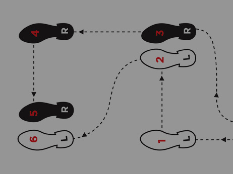
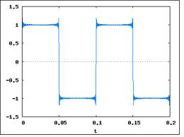

..  _texas-four-step:

The Computer Dance
##################

..  include::   /references.inc

..  seealso::   Text: Chapter 1

Machines are often thought of as physical things. But more and more, we
"simulate" physical machines with "virtual" ones. Thanks to fast computers, and
fantastic graphics systems, we can create "virtual machines of all kinds.

I am a Pilot, and I love flying "real" airplanes. However doing so is
expensive, and for some kinds of flying, not really necessary. Instead, I can
use a simulator to create a "virtual world" and a "virtual airplane" to fly in
that world. In fact the FAA lets me log some amount of time when I practice
flying on instruments, as though I was flying in the clouds and cannot see the
ground anyway. I am focused on that virtual instrument panel, navigating to
some airport. Much cheaper!

Obviously, we are not going to build a simulator for an airplane in this class,
but we are going to build one for a simple computer system to figure out how
things work.

Building a Computer
*******************

Von Neumann's paper laid out the basic components of a computer over 70 years
ago:

    * Control Unit

    * Memory Unit

    * ALU (math/logic) Unit

    * Input/Output Unit

Great! But how do they work?

The Texas Four Step
===================

The answer is actually fairly simple. We will make the machine do a simple
dance. Well, not actually, but what it will do is similar to dancing.

We live in Texas, so I am going to assume you know something about two-stepping
(even if you cannot dance a step!). Basically, something starts up making noise
to set up a "beat" that you can hear. 

Around here, it is probably music by this guy:

..  image:: GeorgeStrait.jpg
    :align: center

Then you start a series of steps in a specific pattern until you complete one
"two-step" motion. 

Next, you do it all again, and again, and so on. Simple! (Right! Try it on a
crowded dance floor and see how that goes!)

Setting up a Beat
-----------------

It is fairly easy to create a beat for the computer to follow. We use something
called an "oscillator", which is a circuit that simply changes from a "0" to a
"1" and back again, over and over. The signal looks something like this:

Often, we control the speed of this oscillator using a crystal that precisely
sets the speed of the signal. We call the entire circuit that gets this signal
going the "system clock". That is the thing running at 2.6 GHz in your modern
PC. Each cycle is one Hertz, and the clock in many machines "ticks" at several
billion cycles per second, which we call Giga-Hertz, or `GHz` for short.

The actual speed of this clock depends on the machine. In our work, we will use
systems with clocks as slow as 16 Mega-Hertz (`MHz`), and as fast as that 2.6
GHz. My fastest computer runs at over 4 GHz. We are reaching the point in the
development of computers where going faster may not be possible due to the
limits of the physics of moving electrons around. 

..  note::

    Every time we think that is about to happen, we invent a new way to do
    things, and the speed limit goes up! Look up `Moore's Law
    <https://en.wikipedia.org/wiki/Moore's_law>`_ for more information about
    all of this.

Once we have this beat running, we can perform actions in sync with this
signal. 

The Computer's Steps
--------------------

Obviously, we do not want our computers to dance. They might fall off the
table! Instead, we have them perform a series of four simple steps:

    * Fetch

    * Decode

    * Execute

    * Store

Fetch
*****

Von Neumann set up a design where both instructions, things that tell the
machine what action to perform, and data live in the memory unit of the machine.
We fetch one of those instructions as the first step.

Decode
******

Instructions are encoded as binary numbers in the memory unit. After we fetch
an instruction, we need to make sure it is a valid instruction. Not every
possible binary pattern is a valid instruction. Some computers have only a few
dozen instructions, and other many have several hundred instructions. We verify
that the pattern we fetched is actually one of those the machine understands.

We also go back to memory and get anything else needed to complete that
instruction, like data the instruction might need to perform the action,
perhaps.

Execute
*******

Once we have everything needed to actually perform the action specified by the
instruction, we do that action. That might involve routing the data we have in
hand to the ALU, or the Input/Output units. Sometimes, we get a result back,
from the ALU for example.

Store
*****

In some texts, this  last step is called "retirement". We need to finish off
the action by putting any results we generated while executing back in memory.
We might also store some additional information telling us what happened during
executions, as status information.

Repeat!
*******

We do this simple pattern over and over, until the power goes away!

That is all a computer ever does. Why do we fear them as such powerful beasts?
They are not fearful at all.

::

    Computers are stupid. They are just stupid so fast, they look smart!

So, What is a Virtual Machine?
******************************

Once we know how a machine works, we can write a program that acts just like a
real machine. If we do this well enough, we will be able to load the same
"executable" file we might hand to a real computer and run it inside our
software machine. That is the essence of the virtual machine.

In the early days of :term:`VM` systems, programmers got things running, but
the machines were very slow. As processors got faster, the :term:`VM` systems
got faster as well, and folks started using them to test things.

Since a :term:`VM` is written in a high-level language, we can take the program
to a different machine entirely, and run our tests there. This idea lets you
play with a system without actually owning such a system.

In fact, we are building such a machine in our lab work. There is not physical
RPN machine that acts ike ours, we are inventing it as we go!

Speeding Up VMs
===============

There is one more neat trick up the sleeves of :term:`VM` programmers. If we
are emulating the exact same machine out program is running on, then modern
processors can actually run some of the instructions on the physical hardware,
rather than in software. This will speed up those instructions, making the
:term:`VM` that much faster. The trick in doing this is that the real processor
cannot be impacted by doing this trick, and making that happen is complex.
Those machines capable of managing this have Intel VT-x extensions on the chip,
(or the AMD equivalent) and the test program we used at the start of the class
identifies such chips.

A Simple Oscillator
*******************

Before we leave this topic, let's take our first look at a simple digital circuit:

..  circuits::
    :align: center
    :tikzopts: circuit logic US
    :tikzlibs: circuits.logic.US,calc

    \node[not gate] at (1,0) (n1) {};
    \node[not gate] at (2,0) (n2) {};
    \node[not gate] at (3,0) (n3) {};

    \draw (0,0) -- (n1.input);
    \draw (n1.output) -- (n2.input);
    \draw (n2.output) -- (n3.input);
    \draw (n3.output) -- (4,0);
    \draw (0,0) -- (0,-1) -- (4,-1) -- (4,0);

Those three symbols in this circuit are "inverters". If they get a digital "1"
coming in on the left, they produce a digital "0" on the right side (or the
opposite). It takes a little time for this to happen, and that is why this circuit is interesting.

On the surface it seems kind of silly to hook up these inverters like this.

Think about it:

    If the input to the first inverter is a "1", the input to the second one
    will be a zero, and the input to the third one will then be a zero.

But wait! (My brother in law loves that phrase. You hear it all the time in
commercials!)

The output of inverter three is fed back (feedback) into the first gate. We
said that was a one, but now we see that it will be a zero instead. Both cannot
happen simultaneously!

It would seem we have a problem here, and we might if the gates changed state
instantly. But they do not. It takes a slight amount of time to change the
output for each stage in this loop. As a result, the circuit starts to
"oscillate", meaning the output from stage three switches from "0" to "1" to
"0" (on and on) until you power it down!

The accuracy of this oscillator is not great, and it will not go very fast, but
it does demonstrate how we can use a chunk of digital circuitry made up of
really simple parts, to produce a circuit that operates on its own and
creates a string of pulses. 

Hey, let the dance begin! We have a clock!

Drum roll, please!

..  vim:filetype=rst spell:
