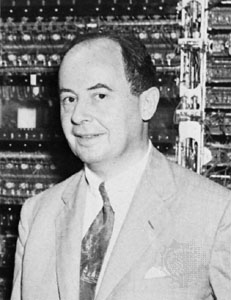

..  _von-neumann-machine:

The Von Neumann Machine
#######################

John Von Neumann was an important figure in the history of computing.

His contributions to that history really began when he authored this document
in 1945:

    :download:`FirstDraft.pdf`

World War II
************

Back in 1945 -- World War II was still going on -- John Von Neumann was
thinking about the whole business of computing. He published his paper as part
of work to build an electronic computing mchine, and started the world on a
whole new track.

..  note::

    As a computer professional, you should read some of these early papers to
    get a feel for how these machines came into being. I recommend this paper,
    and others by George Boole, and Alan Turing as well.
    
Von Neumann explained to the world (in 1945) how an electrical device with a
``Stored Program`` could process information. Although he did not come up with
these ideas alone (he was working with a team of scientists and engineers
building this first machine), Von Neumann was the first to write everything down
in a way that was clear and easy to understand. We call the architecture he
described, a "Von Neumann Architecture" but major features of the architecture
should be properly attributed to others, like Eckert and Mauchly who built the
first stored program machine at the University of Pennsylvania in 1943 (ENIAC).
Today, Alan Turing is credited with having come up with some of the basic
principles that led to the development of the computer as well. 

His Computing Mechanism consisted of four fundamental parts: 

* A *Central Arithmetic Unit* (CA) to do the number crunching 
* A *Control Unit* (CU) to manage the machine
* A *Memory Unit* (M) to store programs and data
* An *Input/Output Unit* (IO) to get things into and out of the machine

How the parts are organized
***************************

As obvious as this might seem today, back when Von Neumann was doing his work,
few people really had any idea what an automatic calculating device should look
like, so this paper was hugely important to those people who set out to build
one. The first machines to come out were huge, used immense amounts of
electricity, broke often, but they worked!

A computer is really just a fancy electronic device that does very simple
things. There is nothing magic about this. A human could act as the Control
Unit, a piece of paper could function as the Memory, a calculator as the
Central Arithmetic Unit, and the keys and display of the calculator as the
Input/Output device. 

To this day, most computers follow this basic architecture. This course focuses
on creating programs for the most fundamental part of the modern computer - the
*Control Unit*, or the *Central Processor Unit (CPU)*. In today's computer
systems, the control unit and the arithmetic-logic-unit are packaged in a
single integrated circuit. We will concentrate on one of the most popular of
these chips - the CPU of most IBM-PC class of computers.  Specifically, we will
look at the Intel Pentium processor, and later at two much different chips - called
microcontrollers.

Von Neumann's Machine
*********************

The first electronic computing machine was actually constructed in England. It
was called EDVAC. The first such machine in the US was Eniac, built at Penn
State. There is some debate, even today, over which machine came first, but Von
Neumann's place in history was assured by his paper, which was widely circulated
and became a handbook for further development of electronic computers.

    EDVAC

This beast weighed in in tons, and was huge in all its glory. It was also fragile!

