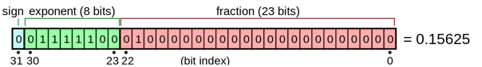
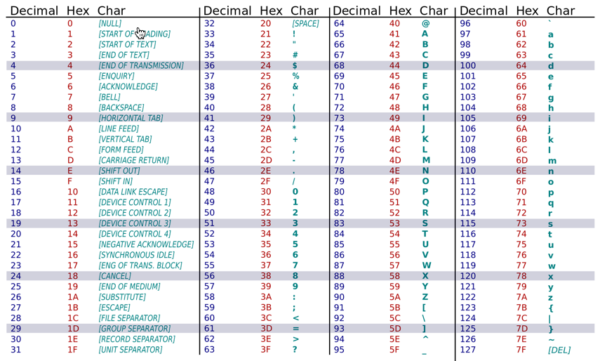

..  _data-encoding:

..  include::   /references.inc

Data Encoding
#############

:Readings: Appendix A (A.1 - A.3)

We have seen that computers use simple binary digits to represent anything we
put into them. (OK, so really they use voltages we interpret as binary digits) 

Two Kinds of Stuff
******************

The memory of a modern computer stores two basic things:

    * Instructions - that tell it what to do

    * Data - the things those instructions will alter

Both kinds of things are `encoded` as a bunch of binary digits (`bits`) stored in
memory containers.

How Memory is Organized
***********************

Most modern computers organize memory as a set (huge) of 8-bit containers, each
with a specific `address` (think house number). We can combine multiple 8-bit
chunks to store bigger things, but the smallest container we can reserve for
anything is one 8-bit chunk.

We name these chunks as follows (for the Pentium, at least):

    * 8-bits - `bytes`

    * 16-bits - `words`

    * 32-bits - `double words` or `dwords`

    * 64-bits - `quad words` or `qwords`

    * 80-bits - `ten byte words` or `twords` for floating point data

In some contexts, `word` may refer to the natural size of a block the processor
grabs. For instance, a 64-bit machine, like the Pentium, normally grabs memory
in 64-bit chunks. That might be called a `word` in some texts. 

..  note::

    Blame Intel for sticking us with the notion that 16-bits is a `word`.
    Legacy issues always haunt us as we march on!

Encoding Integers
*****************

Integer numbers are simple. Well, at least positive (unsigned) integer numbers
are simple. We just assign the equivalent binary number for each decimal number
we want to use. We do need to be aware that the biggest value we can store in
one of our natural container sizes is limited by the number of `bits` we have
available.

The formula for finding that biggest number is simple:

    * max_value = 2 ^ (number of bits) - 1

So for 8 `bits`, we can reach 2^8 - 1 = 256 - 1 = 255

Remember, zero counts as a possible value, giving 256 values, but 255 is the
biggest we can store.

For 16 `bits`, the max value is 16535. I will let you figure out how big other
sizes can be (which you should have done as  part of last week's homework!)

Encoding Signed Integers
************************

We have a problem dealing with signed integer numbers. How are we going to
figure out the sign of the number?

One simple idea is to reserve one bit, probably the left most bit (why) as a
`sign bit`. That might work. Except for one problem. Math!

Let's try adding a positive number like 5, to a negative number like -5. What
should we get?

..  code-block:: text

    5  = 00000101
    -5 = 10000101
    -------------
       = 10001010

That sure does not look like zero! Worse yet, there are two possible encodings
for zero! One for positive zero, and one for negative zero. Do not let your
math teacher hear you talk about positive or negative zero, there is no such
thing!  Zero is zero! Period!

Twos-Compliment Encoding
========================

To deal with this problem, computer folks came up with a clever scheme to
encode negative numbers. It involves doing the following operations:

    * compliment the positive number. (change the bits from 1 to 0 and visa
      versa).

    * add one to the result!

Weird, but let's see what happens:

..  code-block:: text

    5 = 00000101

    Compliment = 11111010
    Add 1      = 11111011

    so

    5  = 00000101
    -5 = 11111011
    -------------
        100000000

That does not look like zero, except for one simple fact. If you are working
with fixed size memory containers, like a byte in this example, you cannot push
nine bits into a container that will only hold eight. So, we drop that ninth
bit and the result is what we were after, zero!

Simple. 

..  warning::

    Do not try to convert a positive number whose left most bit is a one. If
    you have such a number, add a leading zero on the left end to make things
    come up right.

Notice one more thing.

A positive number will (should) always have a leading zero on the left, and a
negative number will always have a leading one on the left. So, we get a sign
bit for free! 

Extending the size of a number
==============================

We will always need to express our numbers in the computer as full memory
cells, however big we like as long as they are taken from those standard sizes
above. If we need to make the number bigger, we simply `extend` the sign bit to
the left. That means that a 16 bit version of plus and minus 5 would look like
this:

..  code-block:: text

    5  = 0000000000000101
    -5 = 1111111111111011

Math still works, and all is right with the world!

Encoding Floating Point Numbers
*******************************

This kind of data is more difficult to deal with, because the range of possible
values is huge! We need to treat floating point numbers in a different way.

Here is an example:

..  code-block:: text

    PI = 3.1415926
    PI = .31415925 * 10
    PI = 0.0031415926 * 10^3

It looks like we can come up with a scheme where we store the `significant
digits` in the number, then add a part that tells us where to put the decimal
point. We want the most `significant digits` we can get so we have the most
accurate number we can have.

The Institute of Electrical and  Electronic Engineers (IEEE) Society has
defined a standard encoding for floating point numbers.

Here is their scheme for a 32-bit number:

    * 1 sign bit

    * 8 bits for exponent (2's compliment form)

    * 23 bits for `mantissa` (significant digits) 

The actual encoding of the 23 bits of significant digits is a bit more
complicated, and we will not worry about that for our work. In fact, we will
focus on integer data for most of our work.

Encoding Text Data
******************

We need a simple way to encode text data as well. In the early days of
computing, most designers spoke English, so the encoding scheme they came up
with was adequate to deal with English text. The American Standard Code for
Information Interchange (ASCII) is the is the encoding:

Look closely at how things are organized. All the letters are in order, and
upper case is in a nice alignment with lower case. All of this makes converting
things from one case to another easy, and makes figuring out alphabetic
ordering easy as well. 

Unicode Encoding
****************

Unfortunately, the entire world does not use the English alphabet. In fact some
countries use funny squiggles a their character set! Chinese folks need to
learn about 4000 symbols to read a newspaper! That is far too many to put on a
keyboard, and we cannot encode those symbols in an 8-bit number. 

SO, folks came up with a new 16-bit encoding scheme called Unicode.

We will not go over this scheme here, but you should be aware that most
programming languages are moving to support Unicode. You need to think about
International users of your work when you build serious applications!
    
..  vim:filetype=rst spell:

