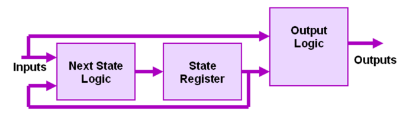

Storing Bits
############

..  include::   /references.inc

..  seealso::   Appendix (A.8)

The digital components we have seen up to now are not enough to build a
real computer system. All of the basic gates are :term:`combinational`,
which just means that they do not hold on to the signals entering them.
Instead, they transform those signals and push them out their output
paths as fast as they can. The time it takes to accomplish this is
called the :term:`propogation delay` of that component, and each
component has a different value for that delay.

If we want to build a component that can remember something, we need a
different kind of circuit. This one, which we will call
:term:`sequential`, will generate a set of outputs from a set of inputs,
but the outputs will depend not just on those inputs, but also on some
internal "state" the component can maintain.

Think about what we want a memory component to do. We want to "write" to
it, nd have it hold onto that data until we decide to "read" from it at
a later time.

Two State Circuit
*****************

Suppose we take two inverters and hook them up this way:

..  circuits::
    :align: center
    :tikzopts: circuit logic US
    :tikzlibs: circuits.logic.US,calc

    \node [not gate] at (0,0) (g1) {$g1$};
    \node [not gate] at (0,-1) (g2) {$g2$};

    \draw (g1.input) -- ([xshift=-5mm]g1.west|-g1.input) --++ (-90:0.3)
        -- (0.75,-0.7) -- ++ (-90:0.3) -- (g2.output);
    \draw (g2.input) -- ([xshift=-5mm]g2.west|-g2.input) --++ (90:0.3)
        -- (0.75,-0.3) -- ++ (90:0.3) -- (g1.output);

Assume we set the input of :math:`g1` to "1". The output will be a "0",
which feeds the input of :math:`g2`. The output of that gate will be a
"1", which loops back to the input of :math:`g1`. Unlike the oscillating
circuit we examined earlier, this one is stable in this configuration,
and nothing will change in it over time. It "holds on" to that state.

You should be able to prove to yourself that it will do the same thing
if we start off setting the input to :math:`g1` to a "0" instead.

The only problem we have with this circuit is providing a way to set it
in one of those two stable states and allowing the input to change
without changing the output until we want to change it.

Let's try a variation of this circuit that uses **NAND** gates instead:

..  circuits::
    :align: center
    :tikzopts: circuit logic US
    :tikzlibs: circuits.logic.US,calc

    \node [nand gate] at (0,0) (g1) {};
    \node [nand gate] at (0, -1) (g2) {};

    \node (sp) at ([xshift=-10mm]g1.west|- g1.input 1) {S'};
    \node (rp) at ([xshift=-10mm]g2.west|- g2.input 2)  {R'};
    \node (q) at ([xshift=10mm]g1.east|- g1.output) {Q};
    \node (qp) at ([xshift=10mm]g2.east|- g2.output) {\~Q};
    \draw (sp) -- (g1.input 1);
    \draw (rp) -- (g2.input 2);
    \draw (g1.output) -- (q);
    \draw (g2.output) -- (qp);
    \draw (g1.input 2) -- ++ (-0.3,0) -- ++ (-90:0.3)
            -- (0.75,-0.7) -- ++  (-90:0.3);
    \draw (g2.input 1) -- ++ (-0.3,0) -- ++ (90:0.3)
            -- (0.75,-0.3)  -- ++ (90:0.3);

The quotes on those names indicate that we control this line by setting
it to "0".  If we start off with both input lines set to "1", this
circuit acts just like the one above. However, if we set :math:`S'` to
"0", the output at :math:`Q` becomes a "1". If we set input :math:`R'`
to zero, instead, the output at :math:`Q` changes to "0".

We call :math:`S'` the "set line, and :math:`R'` the "reset line.  We
only allow one of these lines to change at a time to avoid illegal
conditions.

Memory cells
************

This latch circuit represents a primitive memory cell, but it is not really
practical. Instead, circuits are designed that latch onto the input line
only when a control line  changes from a "0" to a "1" (called the
*rising edige* of a signal.

The output of the cell is whatever was on the input line when that edge
is detected. It holds that value until  then, even if the input changes.

We will not worry about the circuit that accomplishes this, since this
is not a course in digital design. Instead, we will show a single memory
cell like this:

..  circuits::
    :align: center
    :tikzopts: circuit logic US
    :tikzlibs: circuits.logic.US,calc

    \node[rectangle, draw, minimum height=2] at (0,0) (m) {$m$};
    \node at ([xshift=-5mm]m.west|-m.west) (d) {$d$};
    \node at ([xshift=5mm]m.east|-m.east) (o) {$o$};
    \node at ([yshift=-5mm]m.south|-m.south) (w) {$w$};

    \draw (d) -- (m.west);
    \draw (m.east) -- (o);
    \draw (m.south) -- (w);;

We will assume that this component works by holding onto the input data
line value at :math:`d` whenever the "write" signal  edge is detected.
The output displays whatever is held in the cell until it changes.

Real memory is constructed out of a huge number of such cells arranged
in a matrix. We will look at how that is set up in a later lecture.

Generalized Sequential Component
********************************

A more general component looks like this:

..  note::

    This diagram does not show the clock signal, but it is driven by that
    signal.

In this circuit, the input arrives at the component, and can be transformed by
combinational logic before it is available for storing in the memory element.
That transformation can include information currently held in the memory
element. The memory element will not alter its contents until the next clock
signal arrives. At that point in time, the contents of the memory element are
replaced with the new data. 

The output or this component is generated from whatever is held in the memory
element, possibly transformed by additional combinational circuits before the
outside world can see the result.

Formally, this is called a *Mealy Machine* and it is a common device used to
build *finite state machines* (something you will learn more about in a later
course).

Signal Flow
***********

This kind of component is critical to making a machine work in time to the
clock. If all we had were combinational parts, signals would simple flow
throughout the circuit as long as we have power. With a sequential component, a
signal can reach this component and effectively stall until a clock signal
arrives. Well, actually, it does not stall, but it is latched into that memory
component, and held until a clock signal comes along.

Turnng Off a Component
**********************

We also did not show another critical signal, the *enable* line. What this
signal will do is effectively put a component to sleep until we *re-enable* it
later. (Guess which part of the machine has to do this?)

When a component is disabled, the output lines are effectively disconnected
from any output wires. This allows us to have several devices attached to one
wire all generating signals that need to move to other parts of the machine. As
long as we only allow one component at a time to actually put data on a wire,
the machine will work fine!

What Comes Next?
****************

We have see how a basic computer machine is organized, and the basic components
we can use to build one. It is time to look at another critical part of the
system, the lowly wire!

..  vim:filetype=rst spell:
