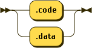

..  _cal-syntax:

CPUsim Assembly Language
#########################

Our machine is evolving. We are at the point where we need to formally define
the syntax of the assembly language we will be creating for this machine.
Having this specification will help make sure we are building the right machine
components.

We are going to write a simple assembler that will process programs written for
our machine. The output of this assembler will be a file that can be easily
loaded into our machine as we run it. Part of our specification will detail
that that file looks like.

..  note::

    The goal here is to keep things simple. This is not a course in formal
    languages, but I will show you how we define a real programming language,
    using notation common in that world. I will also show diagram to help you
    understand what is legal in our language, to assist in writing programs for
    the machine.

CPUsim Program Files
********************

Of course, we need another rule to indicate what a complete program will look
like:

:code_file:

Well, we see that we can have a sequence of basic assembly line instruction
lines in the file, but we can also have lines that declare data items, and
lines that are called "directives" in the file as well.

Directives
==========

These lines tell the assembler, not the machine what to do. More on these lines
later.

Directives can tell the assembler we are defining data, or defining code. It is
easier to organize our thinking if we keep these items separate, and in our
simple machine, they end up in different chunks of memory anyway. 

Here is the rule for these lines:

:directive_line:

Basic Code Lines
================

We have seen this before. A basic line will look like this:

:code_line:

Data Declarations
=================

We define data for our program using a data declaration that looks like this:

:data_dec:

We only support one kind of data: signed integers. However, we will need to use
both signed and unsigned numbers in some places, so we define thes as follows:

:number:

Here is a signed number:

:signed_integer:

Unsigned integers are just a set of bare digits. We will not show a rule for
this, but you could write one! (We will also not define a rule for simple
names. We will just use conventional names in our code).

Code Line Components
********************

Several rules cover everything that can appear on a code line:

label
=====

A label is just a name followed by a colon. It must start in column 1 in our
machine! Nothing else is allowed to start in column 1 except comments!

Here is the definition of a label:

:label:

Mnemonics
=========

We may extend this set later. For now, here are our defined instructions:

:mnemonic:

Operands
========

Operands are complicated because we can have zero, one, or two of them. Operands
tell us where data will come from (and go to) when we do processing. Some data
is "literal", and for our machine, only literal numbers are allowed. Other
operands will specify a register, by name, or a memory location in the data
memory, and we will need to specify the address of that memory location as part
of the operand.

Here are the rules covering operands:

:oper1:

:oper2:

Notice that we do not allow literal numbers in the first position. When we have
two operands, the first is called the "destination", and the second is called
the "source". The rules defining that first operand only allow us to specify a
register or memory location as a possible "destination. The "source" can be
either of these and we allow a literal number here.

Here are the possible ``size`` indicators:

Here are the defined registers:

:register:

Finally, here is an address:

:address:

Comments
========

The last thing we can place on a line is a comment. Here is the definition of
those.

:comment:

We also allow a comment on a line by itself.

Rule Wrapup
***********

Often, a tool that can accept this language can be written as a set of
functions, one per rule. The entire job of each function is to make it through
the rules. Such functions are pretty easy to write, as we will see in a later
lecture.  :1

Although it might seem excessive to define a simple language using all these
rules, it is exceeding important to do so. The rules can be checked by
specialized tools to make sure they are complete, and can be processed using a
real compiler. In fact, the compiler for the language can even be generated
directly from these rules, but that is something you explore in a class on
compiler design. I used to teach such a course, and it was a lot of fun!

For our purposes, the rules and associated diagrams will help you create a
simple assembler, and make sure it processes the language we specified. We will
not worry about this for now. This is just to get you thinking about our code
for this new version of the machine.

Assembly Language Grammar
*************************

Here are all the rules, as used in the digram generator tool:

..  code-block:: text

    code_file ::= ( code_line | directive_line | data_dec | comment )+
    code_line ::= label? mnemonic ( oper1 ( ',' oper2)? )? comment?
    label ::= name ':'
    oper1 ::= size? register | '[' ( address | register ) ']'
    oper2 ::= size? register | '[' ( memory | register ) ']' | number
    mnemonic ::= 'MOV' | 'ADD' | 'SUB' | 'JMP' | 'JNZ' | 'OUT' | 'HALT'
    directive_line ::= '.code' | '.data'
    register ::= 'R0'|'R1' | 'R2' | 'R3' | 'R4' | 'R5' | 'R6' | 'R7'
    number ::= signed_integer | unsigned_integer
    signed_integer ::= '-' unsigned_integer
    address ::= unsigned_integer
    data_dec ::= label? ( 'DB' | 'DW' ) name ( '=' number )? comment?
    size ::= 'BYTE' | 'WORD'

See that is not so bad. As you get used to this notation, you can add or modify
rules as needed to add new features to your machine.

You should study these rules and diagrams and see if you can spot any problems.
(There are a few we will fix later). For now, these will be enough to get us
started in building a simple assembler. Don't worry, I will show the code for
this part! You focus on the actual machine!

..  vim:filetype=rst spell:

