Defining Languages
##################

..  include::   /references.inc

We are reaching the point where we need to identify the exact instruction set
we want our machine to process. Associated with that decision, is the designing
of a language for the machine. Since humans are very bad at working with
numbers, we will use simple codes to represent instructions, and notation that
looks familiar to most programmers to design our language.

This language is very close to the machine, and must be translated into a form
the machine can understand. We call the language ``Assembly Language`` and the
tool we will use to process this language is called an ``Assembler``.

Designing a language (and a processing tool) is a fascinating area of computer
science. We will take a brief look at how languages are specified, then use
these techniques to design our assembly language.

..  note::

    We do not have time to get into the generation of an assembler in this
    class. Instead, our language will be simple enough that translating our
    code by hand will be fairly easy.

Formal Languages
****************

The topic we are headed into is called "Formal Language Theory", something you
will learn more about when you take a compiler course. For our purposes, we
need to explore hoe to define a simple language, and then process files
containing those languages.

..  note::

    In some circles, this is called building "little languages" to help in
    building a bigger project.

Defining a Language
===================

There is a simple language we can use to define a new language. It is called
*Backus-Naur Form*, a simple notation for defining exactly what constitutes a
legal *sentence* in some language. We will us a variation of this notation,
which called *Extended BNF, or *EBNF*, for our project.

Here is the definition of *EBNF*, written in *EBNF*:

..  code-block:: text

    grammar = { rule } ;

    rule = identifier "::=" expression ";" ;
    
    identifier = letter { letter | digit | "_" } ;
    
    expression ::= term { "|" term } ; 
    
    term ::= factor { factor } ;

    factor ::= identifier | terminal | group | repetition | optional ;

    option ::= "[" expression "]" ;
    
    group ::= "(" expression ") ;

    repetition ::= "{" expression "}" ;
    
    terminal ::= "'" character { character } "'" 
               | '"' character { character } '"' ;
 
    character ::= letter | digit | symbol | "_" ;
 
    letter ::= "A" | "B" | "C" | "D" | "E" | "F" | "G"
        | "H" | "I" | "J" | "K" | "L" | "M" | "N"
        | "O" | "P" | "Q" | "R" | "S" | "T" | "U"
        | "V" | "W" | "X" | "Y" | "Z" | "a" | "b"
        | "c" | "d" | "e" | "f" | "g" | "h" | "i"
        | "j" | "k" | "l" | "m" | "n" | "o" | "p"
        | "q" | "r" | "s" | "t" | "u" | "v" | "w"
        | "x" | "y" | "z" ;
    
    digit ::= "0" | "1" | "2" | "3" | "4" | "5" | "6" | "7" | "8" | "9" ;
    
    symbol ::= "[" | "]" | "{" | "}" | "(" | ")" | "<" | ">"
        | "'" | '"' | "=" | "|" | "." | "," | ";" ;
    
The notation formally defines the *syntax* of the language, but does not really
explain what is going on here. We need to a add bit of extra detail to define
the "semantics* of something written in this language. *EBNF* does not address
this part of language design, and we will just use an informal scheme to
explain things here:

    * ::= : is defined as
    * unquoted words : Non-terminal symbols (name another rule)
    * (...) : precedence grouping
    * [...] : optional symbols
    * {...} : symbols repeated zero or more times
    * "|" : alternative ("or")
    * Quoted text ("..." or '...') : Terminal symbols (must appear exactly

Sometimes, you will see a graphical representation of a language defined using
*EBNF*. Here is such a diagram for *EBNF* itself, produced using a neat online
tool*railroad diagram* to see what a legal program looks like:

Here are the diagrams defining *EBNF* (from http://www.bottlecaps.de/rr/ui):

..  note::

    This tool uses an alternative form of *EBNF*. Instead of "{".."}", it ises
    "("..")?", and instead of "{".."}", it used "("..")*". The end of the rule is
    not marked by a semicolon.

:grammar:

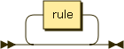
 
:rule:

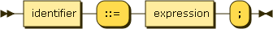
 
:identifier:

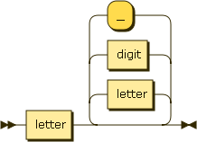

:expression:

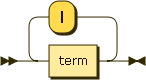
 
:term:

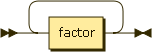
 
:factor:

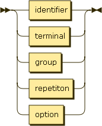
 
:group:

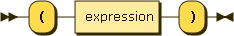

:option:

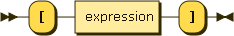

:repetition:

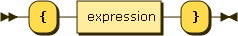

:terminal:

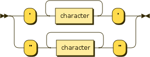

:terminal:

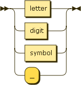
 
:letter:

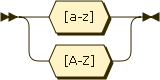
 
:digit:

 
:symbol:

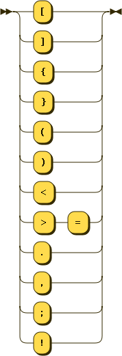

With a little practice, you should be able to use this nottion to define simple
languages. We will use a simple scheme called *recursive descent parsing* to
process our little languages.

..  note::

    This technique is pretty old. In fact, one of my favorite books, dating back
    to 1976, showed how to build a full compiler for a Pascal-like language. The
    author was the designed of the Pascal Language: Niklaus Wirth
    (:cite:`Wirth:1976`) This example was used almost directly to build many of the
    early compilers for the personal computer.

Processing Text Files
*********************

Once we have a formal definition of the syntax of a language, we can build a
tool to process files written in that language. We will not be building a full
compiler here, but we will introduce the basic parts of such a tool.

The basic processing of any program file follows this pattern:

    * source_file -> scanner -> lexer -> parser

Scanner
=======

The *scanner* processes the source file as a stream of characters. It usually
keeps track of things line the line number, and character position on a line
for each character it handles. Scanners know nothing about the language being
processed. They do know about the character set being used. (We will keep
things simple, and just use ASCII).

Lexer
=====

The *lexer* breaks up the stream of characters into identifiable chunks we will
call *tokens*. Tokens include things like identifiers, numbers, special
punctuation, etc. 

In most programming languages *whitespace* is ignored. This includes spaces,
tabs, and newlines. In a few languages, the white-space must be treated
carefully. Python uses *indentation* as a significant part of the language, we
we need to handle indents and dedents properly. This can get messy, so we will
not be doing that in our work.

Parser
======

The *parser's* job is to check the rules. The parser will accept a stream of
tokens only if they fully obey all of the rules defined for the language.
Writing a parser is something you need to do at some point. We will use a
technique called *recursive descent parsing* to derive our parser code directly
from the *EBNF* rules. 

..  warning::

    I am skipping a lot of things you will learn in that compiler course. Our
    languages will be very simple!

As the parser recognizes constructs from our language, it can be taught to
generate output. In a real compiler, the parser will build an internal data
structure representing the program processed, then analyze that structure to
generate the final product of the compiling process. We will be integrating our
parser into our simulator code, so it may not be producing any output directly.
(We may generate some output for debugging purposes, though!)

..  vim:ft=rst spell:

