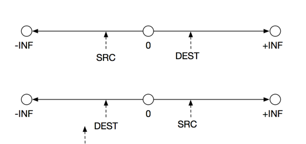
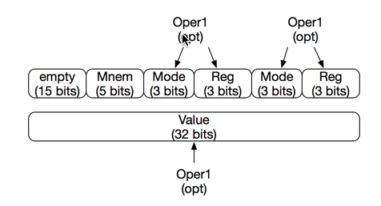

..  _encoding-instructions:

Encoding Instructions
#####################

After designing our Basic Assembly Language ISA, we next need to figure
out how to encode all of these instructions and operands in a way that
makes decoding as simple as possible later in the machine. We want the
machine to process only binary data (integer numbers in our virtual
machine), so the encoding has to be simple. Lets see how we might do
that.

Encoding Basic Instructions
***************************

This part can be easy. All we really need to do is assign a unique code to each
basic instruction we allow in our machine. A simple C++ ``enum`` will do that,
assigning integer codes to each name se set up:

..  literalinclude::    controller/mnemonics.h
    :linenos:

..  note::

    You might find decoding easier if instructions are grouped in some way, but
    for our simple machine, this is probably not necessary.

Flags
*****

We will define the following flags for our machine. All are simple
boolean variables:

    * ZF - Zero Flag

    * SF - Sign Flag

    * OF - Overflow Flag

ZF
==

Setting this bit is simple. If we generated a zero as a result, we set it
(ZF=1), clear it (ZF=0) if not.

SF
==

Setting this bit is simple. All we need to do is determine if the result is
positive (SF=0) or negative(SF=1).

OF
==

This bit indicates that the result of a signed integer operation resulted in a
number too big (positive) or too small (negative) to store. This is an error
condition in our machine.

..  note::

    The **OV** flag is only set when the sign bit of a result changes as a
    result of adding two numbers with the same sign, or subtracting two
    numbers with opposite signs. That means we have the wrong sign for the
    result and the number we just generated is invalid.

How we will handle this is something we need to think about. Since we are
limiting our virtual machine to data types of type integer (signed), we will
need to do math at a higher precision to detect this situation when we do math.

Operands
********

Our machine defines two kinds of operands: SRC and DEST. Remember that all data
items are integers in our machine, and all places in the machine are sized to
hold these integers. We cannot store anything bigger than a standard 32-bit
integer number (assuming your compiler uses 32-bits for C++ type ``int``).

SRC
===

A source can be a memory location, register, or a literal number that
represents an address or a signed data item. Addresses must fall in the range
of available memory, or the machine should generate an error.

Examples of SRC specifications in our code could look like this:

    * 1234 - literal number or address (validate before use)

    * name - variable name or instruction label. Both are addresses

    * R1 - contents of register R1

    * [1234] - contents of memory at this address

    * [name] - contents of variable (at the address where the variable
      is stored

    * [R1] - contents of the memory location whose address is in R1

..  note::

    We will allow some simple math to be done on these addresses, but the
    actual use of the address should be checked to make sure it falls in
    available memory.

DEST
====

A destination can be a register or a memory location. Again, we will allow
simple arithmetic operations to calculate the final address. This will allow us
to work with simple arrays of data items. The calculated addresses must be
within the available range of addresses, or the machine should generate an
error.

The available operand forms includes all of those available for a SRC operand,
except use of a literal or name in this spot. You cannot put something into
something that ends up encoded in the instruction. The DEST must specify a
place that can receive the value. You can only put something into a register or
memory location!

Registers
=========

For simplicity, we are going to define eight general purpose registers. They
will be named R1..R7.

Memory References
=================

Our operands will name either registers or address locations, in which case we
mean that we are referring to the address itself, which must be in the range of
legal values.

If we mean to refer to the "contents" of a memory location, we will surround
the operand with square brackets. This is a clue to the programmer that we are
dealing with the information at that address, not the address itself!

In the sections that follow, we will la out each instruction in detail,
including a specification of how the machine should process the instruction,
and what flags may be affected by each instruction. This should be detailed
enough to implement that ISA in our virtual machine.

Data Movement Instructions
**************************

MOV
===

::

    DST <- SRC
    PC <- PC + 1

    Flags: None

All data addresses refer to the data memory unit of the system, and addresses
should be checked to make sure they fall in the legal range for this machine.
Otherwise an error should be generated.

Arithmetic Instructions
***********************

Obviously, these instructions are going to be processed in the ALU, and will
require data to do the operation. Each instruction in this set needs two
values, and the result will end up in the DEST operand. The general form is

    * OP DEST, SRC where OP is one of the defined instructions below.

ADD
===

::

    DEST <- DEST + SRC
    PC <- PC + 1

    Flags: OF, SF, ZF

SUB
===

::

    DEST <- DEST - SRC
    PC <- PC + 1

    Flags: OF, SF, ZF

MUL
===

::

    DEST = DEST * SRC
    PC <- PC + 1

    Flags: OF, SF, ZF

DIV
===

::

    R1 <- DEST / SRC
    R2 <- DEST % SRC
    PC <- PC + 1

    Flags: OF, ZF, SF undefined

Branch Instructions
*******************

All destination addresses in these instructions should fall in the range of
legal values for the instruction memory of the system. An error should
generated otherwise.

JMP operand
===========

::

    PC <- Operand;

    Flags: None

Conditional Jumps
=================

All of these branch instructions reference the current values stored in the
flag registers.

Checking Conditions
-------------------

The CMP instruction does a simple subtraction of the SRC value from the DEST
value and sets flags. It does not store the actual result. We need to
understand what it means for one number to be bigger or less (or equal) to
another number.

Consider the simple "number line" which extends from minus infinity on the left
to positive infinity on the right. In the middle we have the zero location. Our
SRC and DEST values are located at some points along this line, on either side
of the zero point. Something like this:

In this diagram, we are going to ask how SRC nd DEST relate to each other, by
subtracting SRC from DEST. If DEST is to the right of SRC, the result should be
positive no matter where those two points are. We will set SF to zero in this
case. This means the DEST is greater than SRC. Try it to convince yourself of
that.

If DEST is to the left of SRC, the result will be negative, again no matter
where on the number line the two points are. We will set SF to one in this
case, indicating the negative result. In this case DEST is less than SRC.

So, it would seem that we can just test the SF flag after the CMP instruction
to see what the condition is, and set the SF flag and the ZF flag to see how
each branching instruction will work.

If both DEST and SRC fall on the same point, DEST is equal to SRC, as should be
obvious.

To ask the compound questions (GE or LE) we test to see if

JE
--

::

    IF ZF == 1:
        PC = Operand
    ELSE
        PC <- PC + 1
    END

    Flags: None

JNE
---

::

    IF ZF != 0:
        PC <- Operand
    ELSE
        PC <- PC + 1
    END

    Flags: None

JL
--

::

    IF SF != OF:
        PC <- Operand
    ELSE
        PC <- PC + 1
    END;

    Flags: None

JLE
---

::

    IF ZF == 1 or SF != OF
        PC <- Operand
    ELSE
        PC <- PC + 1
    END

    Flags: None

JG
--

::

    IF ZF == 0 and SF == OF:
        PC <- Operand
    ELSE
        PC <- PC + 1
    END

    Flags: None

JGE
---

::

    IF SF == OF:
        PC <- Operand;
    ELSE
        PC <- PC + 1
    END;

    Flags: None

Procedure Instructions
======================

Procedure instructions are a form of branching, but they remember where the
call was located, and can find their way back there.

CALL
====

::

    Push(PC)
    PC <- Operand

    Flags: None

RET
===

::

    PC <- POP()

    Flags: None

Stack Operations
****************

The stack will be implemented as a separate memory area. In our machine, it
will be a simple arraty of integers. We will define a stack pointer ``SP``
which always points to the current "top of stack". When the stack is created
(before the first stack opertion,the stack is empyt and the value f the stack
pointer should be initialized so the first operation will point to the first
slot in the stack memory. That means we initialize the stack pointer to -1,
according to the wy we will manage this stack

..  warning::

    Not all machines operate this way. In some machines the stack starts off at
    a high address and grows downward! Either way will work.

POP DEST
========

::

    DEST <- [SP]
    SP <- SP - 1;
    PC <- PC + 1

    Flags: None

PUSH SRC
========

::

    SP <- SP + 1
    [SP] <- SRC
    PC <- PC + 1

    Flags: None

Logic Operations
****************

NOT DEST
========

::

    DEST <- NOT DEST
    PC <- PC + 1

    Flags: None

AND SRC, DEST
=============

::

    DEST <- DEST AND SRC:
    PC <- PC + 1

    Flags: None

OR DEST, SRC
============

::

    DEST <- DEST OR SRC;
    PC <- PC + 1

    Flags: None

NOT DEST
========

::

    DEST = NOT DEST
    PC <- PC + 2

    Flags: None

System Control Instructions
***************************

OUT SRC
=======

::

    cout << SRC << endl;
    PC <- PC + 1

    Flags: None

IN DEST
=======

::
    DEST <- cin
    PC <- PC + 1

    Flags: None

HLT
===

    running <- false (Machine should stop)

Designing Machine Language
**************************

While we could just use a set of integers to come up with our machine language,
that would be wasteful. Instead, we should "pack" several things into a single
integer, then "unpack" those things during decoding. How do we do this using
simple C/C++ (or Python). Well, we need to work at the bit level to do this,
and it is not hard.

Packing Data into Integers
==========================

Suppose you have a positive 5 encoded in an integer variable, and you multiply
it by 8. What was the binary pattern you started with, and what is the binary
pattern you ended up with. With any luck you should come up with this:

    * 5 = 00000101

    * 40 = 00101000

Do you see what happened? The three significant bits slid to the left three
places. Hmmm, 2 to the third power it 8, and we slid the bits three places to
the left.

What would happen if we divided 40 by eight. I hope we would get 5, and we will
have slid those same bits to the right three places.

We can use this trick to "pack" information into a single number.

C++ Tricks
----------

Actually, though, C++ makes this easy, if we use the "<<" and ">>" operators.
If we code something like this:

..  code-block:: c

    int var = 5
    int result = var << 5;

We get ``result`` set to the result of sliding the bits in var to the left 5
positions. That is equivalent to multiplying by 32! Cute, once you get over the
odd use of the "<<" operator, which you probably only used to output!

As you might suspect, the ">>" operator slides the bits to the right,
effectively dividing by some power of two!

Combining that with a bit of simple math will let us pack and unpack things
without too much trouble!

Bit Twiddling
-------------

Using the logical operators, we cna do interesting things with data to pack and
unpack things!

The AND Puzzle
..............

What would happen is we used the AND operator on two registers::

    REG1 = 37;  // binary 00100101
    REG2 = 7;   // binary 00000111

If you perform the AND operation, the result is 00000101! We effectively
stripped off any bits in REG1, except those in place in REG1 where there was a
one in REG2. We call REG2 a "mask", and setting the bits correctly lets us
strip off (mask) unwanted bits. This is handy in decoding!

C++ has a bitwise AND operator that looks like this:

..  code-block:: c

    int REG1 = 37;
    int REG2 = 7;
    int result = REG1 & REG2;

If we combine "masking" and "shifting", we can pack and unpack our encoded data
much more easily!

We will look at how this is done after we set up our instruction fields.

Mnemonic Encoding
=================

How many instructions do we have?

For our ISA, we have 24 different possible instructions. That means we need 5
bits to encode the mnemonic.

Register Encoding
=================

We only have eight registers, so we only need three bits to encode those.

Operand Encoding
================

This one gets messy, since we have several variations to deal with. We will
have to come up with a unique code for each possibility. In the examples below,
the variations we are considering are in the SRC field:

    * 0 -> no operand

    * 1 -> Literal or address name (number is in instruction).

        * EX: MOV R1, Label1 or MOV R1, 1234

    * 2 -> Literal or name memory reference (number is in instruction).

        * EX: MOV R1, [Label1] or MOV R1, [1234]

    * 3 -> Register reference (we need to specify which register)

        * EX: MOV R1, R2

    * 4 -> Register memory reference (address is in register, we need to specify which register.

        * EX: MOV R1, [R2]

    * 5 -> Register + base (Address is the sum of what is in the register plus
      an offset in the instruction, (we need to specify the register)

        * EX: MOV R1, [R2 + 5]

..  warning::

    Using this scheme it is possible that instructions may take three integers
    to encode.

From this, it looks like we need 3 bits to decide on the addressing mode, plus
another three bits to specify the register if needed. Remember that we may have
up to two operands, so we need two sets of these fields for some instructions.

In summary, our encoding looks like this:

    * Mnemonic (3 bits)

    * Oper1 (3 bits for addr mode, 3 bits for register)

    * OPer2 (3 bits for addr mode, 3 bits for register)

    * Literal or name (32 bits if needed)

So, our machine code can be stored in one or two integer locations. The first
one will need to be unpacked to figure out if we have a second field! Phew!

Here is a diagram showing how this will be set up:

Packing and Unpacking
=====================

We have some work to do to encode the instructions, and that is the job of the
assembler. The machine has to decode the instructions and set up the machine to
execute the instruction!

Here is some code to show how we encode and decode things:

..  literalinclude::    decode/example1.cpp
    :linenos:

Running this example shows that the encoding and decoding operations work as
they should. You should be able to convert this to Python if needed. All that
remains is figuring out if we need another integer from the instruction memory
to provide that optional number and we are ready to execute our instructions!

Test Assembly Language
**********************

The starting point for the final verison of the Cycsi machine is on GitHub at
https:://github.com/rblack42/CycsiV3.git.

Until we get the assembler running, here is a test program file you can use to
start working on your machine. I will add more test code to the project on
GitHub.

..  literalinclude::    testcal/gen_testcal.cpp
    :linenos:

Here is the "machine code" generated from this program:

..  literalinclude::    testcal/test.cal

If you get the machine running, this test program should display a sequence of
integers from 15 to 20.

