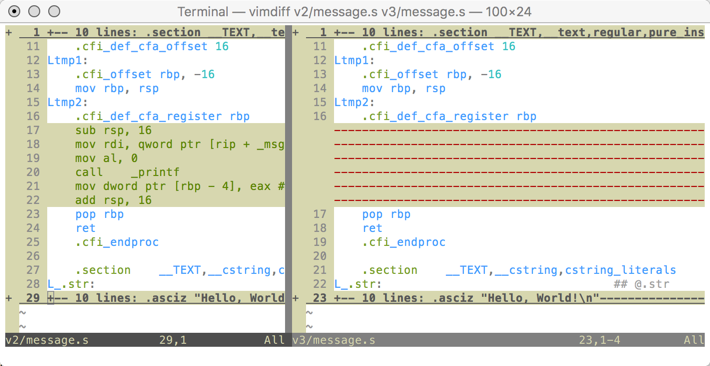

..  _first-look:

First Look at Assembly Language
###############################

..  include::   /references.inc

You all should know how to build a simple"Hello, World" program. This was
probably the first example program you saw when you first looked at C++. We
want to look behind the human programming language and peek at what the machine
actually sees.

To do this, we need to ask the compiler to help us out. That part is pretty
easy. But to see how things are actually being done in a much more clear way,
we need to structure our example a bit differently, and use another tool to
help focus on what is going on.

We will use the Gnu_ C/C++ compiler in our work, and I will be using gVim_ (or
MacVim) to help as well.

Coding the "Right" Way
**********************

I use a programming technique that grew out of years of what we call "hacking"
or "blasting code" today. In my beginning life as a programmer, I spend hours
typing in code I thought would work, only to discover that I could not even get
that code through the compiler. I was a lousy typist and made a lot of stupid
typing mistakes. This resulted in `syntax errors` that kept the compiler from
producing something I could even try to run. Silly!

I finally learned to program using something called "Baby Steps", where you
write only a few lines of code, then compile that. If you make mistakes, they
are very easy to spot, and you get them fixed quickly. Furthermore, those few
lines are crafted to produce some known output, and if I do this right, I can
run the program and see it work! Of course, the program is not finished, and I
will repeat this same process as many times as it takes to produce the result I
am after.

To this process, a modern programmer adds a code management tool, and we will
use Git_ for that here. You will learn more about Git_ as we move forward in
the class, for now, just watch how we use it.

Let's try this out on a very small scale and see what we can produce.

..  warning::

    I will be using C in this example, not C++. The reason for this is that C++
    has a big layer of management code sitting on top of everything working to
    make those "object" things work properly. We do not need this layer when we
    start looking at what the machine is really doing. In this example the
    differences between C and C++ are mostly confined to input/output. You
    should be able to follow this, even if you never saw a C program before!

Baby Steps Example
******************

We want to show how to write code using small, well thought out steps. Before
you type in a single line of code, you need to write down a few things.
Specifically:

    * What is this block of code going to do?

    * What data is needed to do the work?

    * How will I know that it works?

Step 1: Something simple
************************

We start off with something we know will work. Hey, you have to start
somewhere! How about a variation of "Hello, World!:

..  literalinclude::    code/v1/hello.c
    :linenos:

That seems simple enough. It surely is short. It needs no data to run, and I
know what to expect if it works (right?)

How do we run it?

With no IDE, we have to work from the :term:`command line`.

Step 1a: Introducing Make
=========================

Behind almost every IDE you see there is a simple build tool that has been
around for years. That tool is called Make_. Here is a file we can use to build
this program (actually, it will build just about any C program with a few
tweaks!)

..  literalinclude::    code/v1/Makefile
    :linenos:

..  warning::

    The first character on lines 17, 22 26, and 29 (which all look indented) must
    be a Tab character! (Use Ctrl-V->Tab on vim if it is expanding tabs).

Looks pretty cryptic, doesn't it? Well it is actually fairly simple, but there
are a few "magic" rules you need to know, and we will look at them later. For
now, you just need to place this file in the folder with the project code. 

With this file in the project directory, we can compile this program by opening
up a terminal window and typing in this command:

..  code-block:: bash

    $ make

That seems simple enough, almost as simple as clicking on a "build" button in
an IDE.

The output from this command shows how Make_ sends commands to the system to
process your code. It is using rules in that Makefile you provided to figure
all of this out. You need to make sure you set up those rules properly. With
any luck we will end up with a program named ``test`` in the project directory.
We can run that by doing this:

..  code-block:: bash

    $ ./test

..  note::

    In the Linux world, this is how you run a program that lives in the current
    directory. It is easier in Windows, but the executable file name will end
    up ``test.exe``. Then all you do is type "text" and it should run.

Step 2: Move Message to Module
******************************

Next, we move the message to a module:

..  literalinclude::    code/v2/hello.c
    :linenos:

And, here is the module:

..  literalinclude::    code/v2/message.c
    :linenos:

The header file needed to tie the main function to the module is shown next:

..  literalinclude::    code/v2/message.h

All of this should be pretty familiar to those of you who have learned C++. 

Looking at Assembly
*******************

The Gnu_ C/C++ compiler can generate the assembly language needed by your
processor, and then process that code to build the executable. If we ask
(nicely), it will generate the assembly language listing for each file, then
stop (not building the program).

Do this:

..  code-block:: bash

    $ make asm

Make will run the commands needed to build assembly language files for each C
source file in the directory. I will not frighten you by looking at all of
this. Instead, lets peek into the ``message.s`` file:

..  literalinclude::    code/v2/message.s
    :linenos:

Wow, even this looks like a mess. Actually, by the time you finish this class,
most of this will make sense. However, you should note that this code is
generated by the compiler, not a human. It is not intended to be crystal clear,
but it is correct.

Understanding this is not simple at this point. However, we can do something
simple to figure out how C does output. 

..  warning::

    The code you see in these notes was generated on my Mac. It will be
    slightly different in your Linux system. Most of the code I write should
    work on any system. (Windows does need more attention, though).

The code sets up a string in the global data area (outside of any function),
then passes the address of that string to a standard C routine named
``printf``. Look closely at that code above and see if you see those two items.

Let's isolate the output actions by doing something simple.

Copy the entire project directory into another directory. On my system, I
created the original one in a directory named ``v2`` (guess what ``v1`` holds),
and copied it into another directory named ``v3``.

Now edit ``message.c`` and delete the line containing the call to ``printf``. 

Now, generate the assembly files as before.

If you have installed Vim_, there is a tool called ``vimdiff`` that will open
up two files and show you what is different between them. Here is a screen shot
of running this command (above the version directories:

..  code-block:: bash

    $ vimdiff v2/message.c v3/message.s

Here is what I see on my system

Now we can see the differences more clearly. On the left, you see a block of
code highlighted. On the right that block shows as a bunch of dashed lines. All
of the highlighted code seems to be associated with output. 

I see the call to ``printf`` in there, and above that there is a reference to
the message string. This is basically all the code needed to do output: set up
a few storage areas we will learn about later (called registers) and call the
``printf`` routine. That does not seem so hard.

..  note::

    Of course, how ``printf`` gets that message to the screen is a huge mess,
    and we will not bother figuring that out here. Wait until you have a
    serious operating system class to learn about that!)

That should be enough for our first look at assembly language. If you get all of
this running, all of your tools are in fine shape!

..  vim:filetype=rst spell:
