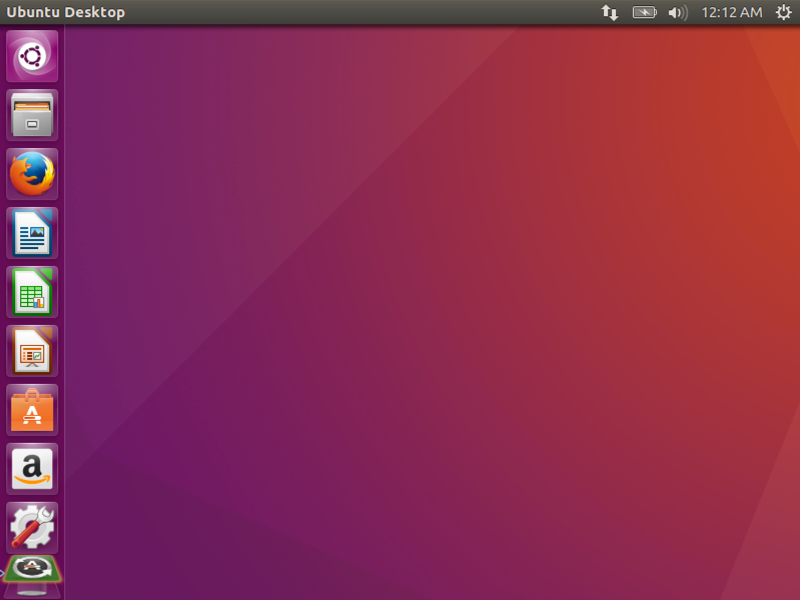

Getting Started
###############

..  include::   /references.inc

We need to do some basic setup work

You probably do not have a Linux system, and may not have worked with Linux at
all. If you have a computer, never fear! We will get you going without sending
you off to buy another computer!

..  warning::

    You need a computer that has a modern 64-bit chip in it. We will be
    installing a :term:`virtual machine`, a program which emulates a real PC, and
    install Ubuntu_ Linux on that system. Your system must support this kind of
    software. If you do not have such a system, contact me and I will provide an
    account on a machine you can reach over the Internet that will do the job.

Install the VM Manager
**********************

For your personal machine, I recommend installing VirtualBox_. It is free and
runs well on most systems. Unfortunately, in the CS abs, VirtualBox_ argues with
one of the installed programs, so they install a version of VMware_ instead.
VMware_ offers a free product, called ``VMware Player``, or you can install
VMware_ Workstation`` which is not free. Either will do. Notes on installing
VMware_ Player are in the Appendix. 

Download the installer
======================

Navigate to the VirtualBox_ website and find the downloads page. There is an
installer for every major platform there. Download the appropriate version to
your machine. Once you have the file on your system, run  it to install the
program. 

Install the Program
===================

Installing this program is simple. Locate the file in ``Windows Explorer`` (or
``Finder`` for you Mac folks) and double-click on it. The installer should
launch like any other program on your system.

..  warning::

    If you are running newer versions of Windows, it might be wise to run this
    file by right-clicking on the file name and selecting "Run as
    Administrator". A few students have had issues with things getting
    installed properly if you do not do that. If you run into any problems, you
    can always uninstall and try again.

Let the program do its thing, and your installation should go smoothly. Several
device drives are needed, and on Windows, you will be asked if it is OK to
install them. Say yes and continue with the installation.

Next Steps
==========

Now, we have a decision to make. You can simply create a new :term:`virtual
machine` using the VirtualBox_ program, or we can use a neat tool called
Vagrant_. I am going to show you how to use Vagrant to get going quickly.

Installing Vagrant
******************

Vagrant_ is a tool that manages pre-packaged :term:`virtual machines` (which
they call "boxes") in a standard way. The program lets you set up systems
quickly for testing. The user community has created a huge number of systems
(even Mac and Windows VM systems) that you can use as long as the license
requirements allow it. Since we will be using Linux, there is not problem with
that.

Download the Installer
======================

Once again, there is an installer for every major platform. Find the
appropriate file for your system and download it.

Install the Program
===================

As you did for VirtualBox_ run this installer to set up your system.

On Windows, the installer is a standard ``.msi`` file which should install
properly without using special privileges.

Test the installation
=====================

This is the neat part.

Make sure you are connected to the Internet.

Open up a :term:`command prompt` window and type this:

..  code-block:: bash

    $ mkdir cosc2325vm
    $ cd cosc2325vm
    $ vagrant init

This will create a file named ``Vagrantfile`` in the current directory. Edit
this file and change it so it looks like this:

..  literalinclude:: Vagrantfile
    :linenos:

Now enter this command:

..  code-block:: bash

    $ vagrant up

It will take a few minutes for the correct version of the OS to download. Once
that has been done, the virtual machine will start up and you should see the
desktop in a window on your system.  You will be logged into the machine, but
your username will be "vagrant" (your password is also "vagrant"). This is not
a big deal, since you only can reach this machine from your own system. There
are ways to tune this system, but we will not worry about that.

Once you are in to the system, you should see the standard Ubuntu_ Linux
desktop. It should look like this:

The virtual machine that you downloaded is actually a file that is "cloned"
every time you fire up a new :term:`virtual machine` using a ``Vagrantfile`` for
the first time. You can create as many as you like, often one per project! When
you log off of the system you should find yourself back at the command line,
and you can do any of the following:

    * vagrant halt - to halt the machine (normally, you do this when done working)
    * vagrant destroy - to remove this machine (but not the downloaded image file)
    * vagrant status - to see what is running.

Tuning the Machine
===================

There are a lot of icons on the left side of this screen. If you hover the
cursor over each one, you will see the name of the program you can launch from
that icon. I remove unneeded icons by right-clicking and choosing "Unlock from
Launcher". I usually end up with only a few icons:

    * Search
    * Files
    * Firefox
    * Ubuntu Software
    * System Settings
    * Software Updater (might not show)

Add a Terminal Icon
===================

Now, click on "System Settings" and search for "term". 

Select the "Terminal" program, and when it is running, right click and select
"Lock to Launcher" This will be your primary interface to the system, and
locking it on the left side will make it easy to launch one or more terminal
windows.

..  warning::

    On my office machine the ``Terminal`` program would not launch. I selected
    "XTerm" instead and that worked fine.

Shutting Down
=============

Feel free to explore the system. When you are done, click on the gear icon on
the top right of the screen and select "Shut Down". This will stop the system.
You can restart it from the command line using the "vagrant up" command you
used earlier. This time it should fire up much quicker. 

Installing Build Tools
======================

The version of Ubuntu just loaded does not have  programming tools
installed. We can fix that by opening a terminal window (click on the icon you set up earlier). Then do this:

..  code-block:: bash

    $ sudo apt-get update
    $ sudo apt-get install build-essential
    $ sudo apt-get install vim-gtk

On that first line, you will be asked for a password. The default password for a Vagrant_ setup is (wait for it) "vagrant". 

After running these commands, try these to verify the tools are installed:

..  code-block:: bash

    $ g++ --version
    $ gcc --version
    $ make --version
    $ gvim -- version

Running a sample program
**************************

Now that we have a working Linux system to play with, how do we create and run
a simple program?

Step 1: set up a working environment
====================================

You should get into the habit of managing where you do work. It is a sad fact
that some folks never seem to know where anything is on their own computers. Do
not let some vendor tell you where to put things, you be in charge.

Build a project directory
-------------------------

On all of my systems, all files related to programming projects live under a
single directory named ``_projects``. The underscore at the front forces this
directory name to appear at the top of any listing of files in my system, so I
can find it quickly. Since all projects are stored under that directory, it is
easy to set up backup procedures, and I know exactly where my files live if I
ever need to find something.

Under this top level directory, I create a directory for each project, named in
a way that helps me remember what the project is about. I might organize
further by using intermediate directories with names like "teaching" if I need
to, to keep things under control.

For this demonstration, we will create a folder named "cosc2325" in the home
directory on the Linux system:

..  code-block:: bash

    $ cd
    $ mkdir cosc2325
    $ cd cosc2325
    $ mkdir Example1
    $ cd Example1
    $ pwd

The first command moves you to your "home" directory, which on our vagrant_
setup will be ``/home/vagrant``. 

..  warning::

    Linux (and Mac) use forward slashes to separate parts of a path to a
    location.

The ``mkdir`` command creates a new folder. The ``cd foldername`` command moves
you into that folder. The last line show you where you currently are on the
system. This is called your "working directory"

In the above setup, I created a place for our test program.

Add Revision controls
---------------------

Normally (not for this example) we would set up our ``source-code-control-system``
for this new project. This is a system that tracks changes to your code
(revisions) so you can recover from bad decisions and back up if needed to a
previous state. All modern programming projects use such a system!

Step 2: Edit your program source code file(s)
=============================================

Once we know where we are going to work, we fire up our trusty programmer's
editor and create the file with our program code, as shown above. We will save
this file in our ``working directory`` with a suitable name. We would probably
use something like ``hello.c`` for this project, since the code shown is
written in the "C" language.

..  literalinclude::    ../FirstLook/code/v1/hello.c
    :linenos:

Step 3: Compile the program
===========================

* You IDE folks just hit ``build``
    * But do you really know what actually happened when you did that?

We already made sure ``gcc`` is installed, so we can just do this:
  
..  code-block:: text

    > gcc -o hello hello.c

This builds an executable program called ``hello.exe`` on a PC, or just
``hello`` on other systems.

What happened?
--------------

* The compiler checked the ``syntax`` of your code

* If correct, it processed your code into an ``object file``

* It ``linked``  your object file with ``C`` runtime files

* It saved the result as an ``executable`` file on your system. 
    
Actually, ``gcc`` is a management program that fires off several other tools to
do those steps listed above. Each step is important, and you should understand
what is happening along the way.

Step 4: Run the program
=======================

If all went well, we can run the program by doing something like this:

..  code-block:: bash

    $ ./hello
    Hello, World!

Wow, it worked!

If you get this far, you are probably a seasoned high-level programmer.
However, this example is too simple for real development work. We will look at
this same example a bit deeper later.

..  vim:set spell filetype=rst:

