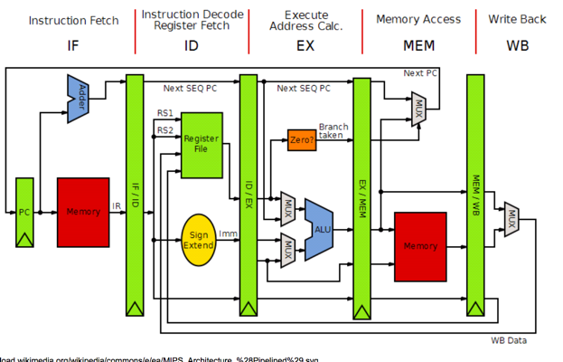
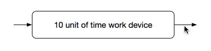
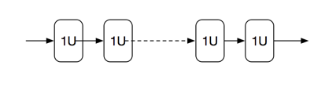
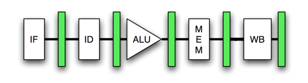

Pipeline Processing
###################

In your emulator project, you modeled the processor using a simple
fetch-decode-execute-reture model. This kind of model is very simple to code,
and works reasonably well as an introduction. We can actually show what a real
machine might look like by using simple registers to capture intermediate
results as internal processing takes place. Here is a schematic of such a
design:

The basic idea here is that the flow of signals through the machine follows our
simple four-step process. (That "write-back" step is intended to complete the
"retire" operation by moving the final results back into memory (or a register).

There is one point in this diagram we need to mention. Notice that the *progrm
counter*, which is always supposed to be set so the next *fetch* is from the
right location, is being updated after the execute stage. We have indicated
that this happens during *decode*. Why the change?

We have not studied branching yet, and that throws a wrench into figuring out
where the next instruction will come from. If we do not branch, then the
address we calculate during *decode* will be correct. However if we do branch,
we need to reset the *PC* to point to the new address. We may not be able to
figure that out until after we run the execute stage. 

In this diagram, we do not show the *decode* stage doing an update, but delay
that update until later in the cycle.

I admit this diagram is a bit scary, since there are a lot of parts scattered
across a big diagram. But those internal *registers* (the tall green rectangles
in the middle) actually make this much simpler to think about. To see why, we
need to look at a new concept.

Pipelining
**********

Here is one simple trick, that does an amazing job of speeding up something.

Consider that you have one unit in your machine that does some work. We do not
need to know exactly what kind of work that is, just work! There are a lot of
parts in a modern computer that do "work" and each takes time to get that work
done!

Let's consider this block, and say it takes 10 units of time to get "work" done:

Now, let's say we have ten items to process in this unit. We cannot feed the
second item into the unit until the first item has exited the unit. So, it will
take 10 * 10 units of time, or 100 units of time to process these ten items.
Can we do better?

Try this:

Break the unit up into ten smaller parts, each taking one unit of time to complete. 

The total time through all ten units is the same as the original unit. But,
let's process our ten items now.

The first item is fed into the leftmost unit. It clears that unit in one unit
of time. We can feed in the second item as soon as the first item clears. That
first item wanders through the second unit as the second item is being
processed. These two processing actions are happening ``at the same time``
(parallel processing!). Wnen the second item clears the first unit, we can
start in the third item. And so on!

We will see the first item exiting the tenth unit in the same ten units of time
it took in the first, non-pipelined processing unit. But one unit later, the
second item exits, then the third. 

The total time it took to complete all item is 10 + (9 * 1) units of time,
or 19 units. That is over five times faster!

Of course, all of this depends on our ability to split up the original ten-unit
processing block into those ten one-unit processing blocks. This is not easy to
do, but that is what we pay computer engineers to figure out, and they do a
pretty good job of it!

Applying Pipelining
===================

Any place in the machine where things are happening one item at a time and that
item works its way through multiple stages is a candidate to apply *pipelining*.
Consider the four-step processing we are studying. We are trying to process one
instruction, but we can break that up into four stages This lets us simplify
our work by  letting us just focus on the individual steps. Here is a simpler
diagram:

Those green rectangles represent registers that act to hold intermediate
results of the processing by each stage. As we have seen, actions stall when
they hit a register, until a clock signal arrives to move data along to the
next stage.

We call this entire flow a "pipeline", indicating that all stages must complete
to fully process one instruction. 

In our simple simulator, we will loop back and begin again or the next instruction.

